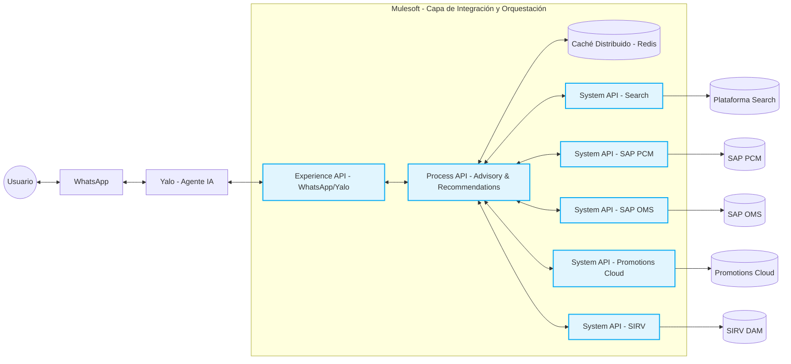
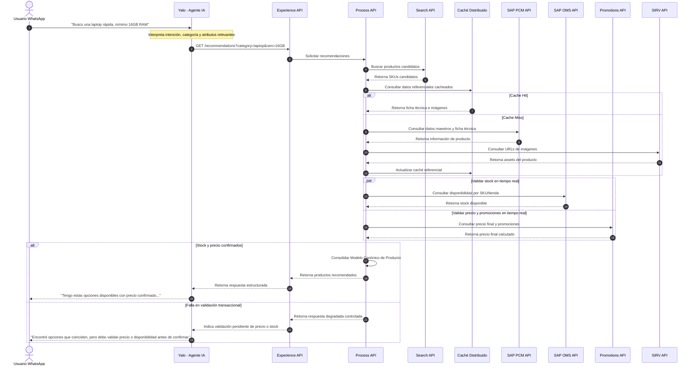

# Arquitectura de Solución para Asesoría Conversacional 24/7 vía WhatsApp

## 1. Resumen Ejecutivo

La presente propuesta arquitectónica define una solución para transformar la experiencia de compra tradicional de la compañía hacia un modelo de asesoría personalizada 24/7 a través de WhatsApp.

El objetivo no es únicamente habilitar un canal de consulta de productos, sino construir una capacidad conversacional que permita al cliente expresar necesidades en lenguaje natural, recibir recomendaciones comparables y avanzar progresivamente hacia una experiencia de compra asistida, personalizada y escalable.

La solución plantea desacoplar el canal conversacional de los sistemas transaccionales y de catálogo mediante una arquitectura basada en API-Led Connectivity, soportada por Mulesoft como capa de integración y orquestación.

La arquitectura propuesta busca cumplir tres objetivos principales:

- Baja latencia en la experiencia conversacional.
- Precisión transaccional en precio, promociones y stock mediante consulta en tiempo real a las fuentes oficiales.
- Escalabilidad funcional y técnica para habilitar futuras fases como métodos de pago, generación de pedidos en SAP y facturación electrónica.

La solución ubica a Yalo como plataforma conversacional especializada y a Mulesoft como capa de integración, gobierno y orquestación hacia el ecosistema actual de sistemas, compuesto por Search, SAP PCM, SAP OMS, Promotions Cloud y SIRV.

---

## 2. Contexto del Negocio

El ecosistema de retail digital exige evolucionar de un modelo pasivo, donde el cliente busca manualmente en un catálogo, hacia un modelo proactivo, donde el canal digital asesora, compara y recomienda productos según la intención real del usuario.

En este contexto, WhatsApp se convierte en un canal estratégico por su alta adopción y baja fricción de uso. Sin embargo, para que este canal sea efectivo, no basta con exponer un buscador tradicional; se requiere una arquitectura capaz de consolidar información de producto, disponibilidad, precio, promociones e imágenes en una respuesta coherente, rápida y confiable.

El agente de IA debe poder responder preguntas como:

- “Busco una laptop rápida para estudiar y jugar”.
- “Necesito una nevera grande para una familia de 5 personas”.
- “¿Cuál televisor me recomiendas para una sala pequeña?”.
- “¿Cuál tiene mejor precio y está disponible hoy?”.

Para resolver este tipo de interacción, la arquitectura debe integrar datos referenciales y datos transaccionales. Los datos referenciales, como nombre, marca, descripción, ficha técnica e imágenes, pueden ser optimizados mediante caché. En cambio, los datos transaccionales, como stock, precio final y promociones, deben consultarse en tiempo real antes de entregar una recomendación final al cliente.

El éxito de la solución dependerá de lograr un balance adecuado entre velocidad, precisión, escalabilidad y gobernanza de la integración.

---

## 3. Arquitectura AS-IS: Estado Actual

Actualmente, la compañía cuenta con un ecosistema robusto pero fragmentado, donde la información asociada al dominio Producto se encuentra distribuida en múltiples plataformas especializadas.

### 3.1 Sistemas actuales

### Plataforma Search

La plataforma Search funciona como motor de búsqueda indexado. Contiene atributos básicos del producto como EAN, nombre, marca y precio referencial.

Su principal ventaja es la velocidad de búsqueda. Sin embargo, su principal limitación es que se actualiza mediante un proceso batch cada 10 minutos desde SAP PCM, por lo cual no debe ser considerada como fuente final para datos transaccionales críticos como precio definitivo, promociones o stock.

### SAP PCM

SAP PCM es la fuente de verdad para los datos maestros de producto. Administra información como descripciones largas, fichas técnicas, garantías y atributos detallados.

Este sistema es fundamental para enriquecer la información que recibirá el agente conversacional, especialmente cuando el usuario requiere comparar productos por características técnicas.

### SAP OMS

SAP OMS administra el inventario disponible en línea. Para la solución propuesta, este sistema debe ser tratado como fuente oficial de disponibilidad.

Cualquier recomendación que incluya disponibilidad debe validarse contra SAP OMS en tiempo real o en una ventana transaccional controlada, evitando recomendar productos sin inventario disponible.

### Promotions Cloud

Promotions Cloud es el motor encargado de calcular precio final y promociones aplicables, incluyendo posibles condiciones por medio de pago, campaña, canal o vigencia.

Este sistema debe ser consultado en tiempo real antes de confirmar el precio final al cliente.

### SIRV

SIRV actúa como plataforma DAM para almacenar, optimizar y entregar imágenes públicas de producto. Su rol es relevante para enriquecer visualmente la respuesta conversacional, especialmente cuando Yalo entregue tarjetas, carruseles o enlaces de producto.

### Mulesoft

Mulesoft está disponible como plataforma de integración y gestión de APIs. En la arquitectura objetivo, será la capa encargada de desacoplar el canal conversacional de los sistemas backend, centralizando la orquestación, seguridad, monitoreo y gobierno de APIs.

### Yalo

Yalo es la plataforma especializada en agentes inteligentes de ventas. Su responsabilidad principal será administrar la experiencia conversacional, interpretar intención del usuario, mantener contexto conversacional y presentar las recomendaciones de manera natural en WhatsApp.

---

## 3.2 Limitaciones del modelo AS-IS

El modelo actual presenta varias limitaciones para soportar un canal conversacional en tiempo real:

Primero, la información del producto está fragmentada. Un “producto completo” requiere datos de Search, SAP PCM, SAP OMS, Promotions Cloud y SIRV.

Segundo, consultar todos los sistemas de manera síncrona y secuencial generaría una latencia inadecuada para una experiencia de WhatsApp, donde el usuario espera respuestas rápidas.

Tercero, existen datos con distinta naturaleza de actualización. Search y SAP PCM tienen información más referencial, mientras que SAP OMS y Promotions Cloud contienen información altamente volátil.

Cuarto, la ficha técnica del producto no es homogénea. Los atributos cambian según la categoría: una laptop puede tener RAM, procesador y almacenamiento; una nevera puede tener litros, tipo de enfriamiento y eficiencia energética.

Quinto, el crecimiento proyectado del catálogo exige una solución escalable. La arquitectura debe soportar el paso de 12.000 SKUs a 22.000 SKUs y operar en múltiples tiendas sin rediseñar el flujo principal.

---

## 4. Arquitectura TO-BE: Estado Objetivo

La arquitectura objetivo propone una solución desacoplada, escalable y preparada para evolución transaccional.

El canal WhatsApp será gestionado por Yalo, mientras que Mulesoft actuará como capa de integración y orquestación hacia los sistemas core. Esta separación permite que Yalo se concentre en la experiencia conversacional y que Mulesoft concentre la lógica de integración, consolidación, seguridad y observabilidad.

---

## 4.1 Principios de diseño TO-BE

### Desacoplamiento del canal conversacional

Yalo no debe conectarse directamente a SAP PCM, SAP OMS, Promotions Cloud, Search o SIRV. En su lugar, debe consumir una Experience API diseñada específicamente para el canal conversacional.

Este enfoque reduce acoplamiento, simplifica el contrato de integración y evita que cambios en los sistemas backend impacten directamente la experiencia del usuario.

### API-Led Connectivity

La solución se estructura bajo el patrón API-Led Connectivity, separando responsabilidades en tres capas:

- Experience API: expone servicios optimizados para Yalo.
- Process API: orquesta la lógica de búsqueda, enriquecimiento y recomendación.
- System APIs: encapsulan la conectividad con los sistemas fuente.

Esta separación permite reutilización, gobierno, trazabilidad y evolución incremental.

### Separación entre datos referenciales y transaccionales

La arquitectura distingue entre datos de baja volatilidad y datos de alta volatilidad.

Los datos de baja volatilidad, como descripciones, imágenes, marca, categoría y ficha técnica, pueden ser cacheados para mejorar tiempos de respuesta.

Los datos de alta volatilidad, como stock, precio final y promociones, deben consultarse en tiempo real antes de entregar una recomendación final.

### Modelo canónico de Producto

La solución consolida la información proveniente de diferentes fuentes en un único modelo canónico de Producto.

Este modelo evita que Yalo tenga que conocer el origen de cada dato y permite entregar una respuesta uniforme, independiente de si la información proviene de Search, SAP PCM, SAP OMS, Promotions Cloud o SIRV.

### Escalabilidad evolutiva

La arquitectura se diseña para resolver inicialmente el flujo de búsqueda y asesoría, pero deja preparada la base para futuras capacidades transaccionales:

- Selección de métodos de pago.
- Generación de pedidos en SAP.
- Facturación electrónica.
- Notificaciones postventa.
- Atención conversacional sobre estado de pedido.

---

## 4.2 Vista conceptual TO-BE

En el modelo objetivo, el flujo se comporta de la siguiente manera:

1. El usuario escribe una solicitud en WhatsApp.
2. Yalo interpreta la intención y extrae entidades relevantes.
3. Yalo invoca la Experience API expuesta por Mulesoft.
4. Mulesoft ejecuta la orquestación mediante una Process API.
5. La Process API consulta Search para encontrar candidatos.
6. La Process API enriquece los productos con información referencial cacheada o proveniente de SAP PCM/SIRV.
7. La Process API consulta en tiempo real SAP OMS y Promotions Cloud para validar stock, precio final y promociones.
8. Mulesoft consolida la respuesta en el modelo canónico.
9. Yalo transforma el resultado en una respuesta conversacional para el usuario.

Este diseño permite mantener una experiencia rápida sin sacrificar la precisión de los datos críticos.

---

## 5. Diagramas de Solución

La solución se representa mediante dos diagramas principales:

- Diagrama lógico de componentes.
- Diagrama de secuencia del flujo de búsqueda y asesoría.

El primer diagrama muestra la topología general de la solución y la relación entre los principales componentes. El segundo muestra la secuencia lógica desde la interacción del usuario en WhatsApp hasta la entrega de la recomendación final.

---

## 5.1 Diagrama Lógico de Componentes



---

## 5.2 Explicación del Diagrama Lógico

El usuario interactúa con la compañía a través de WhatsApp. Yalo administra la conversación, interpreta la intención y mantiene el contexto conversacional.

Yalo no consume directamente los sistemas internos. En su lugar, se conecta a una Experience API expuesta por Mulesoft, diseñada específicamente para el canal conversacional.

Dentro de Mulesoft, la Process API centraliza la lógica de búsqueda, enriquecimiento, validación transaccional y consolidación de respuesta.

Las System APIs encapsulan la conectividad con cada sistema backend:

* Search para búsqueda rápida de productos candidatos.
* SAP PCM para datos maestros y ficha técnica.
* SAP OMS para disponibilidad e inventario.
* Promotions Cloud para precio final y promociones.
* SIRV para imágenes y assets digitales.

El caché distribuido permite reducir latencia sobre datos de baja volatilidad, como información descriptiva, ficha técnica e imágenes. Sin embargo, el stock y el precio final no se responden únicamente desde caché; estos se validan contra los sistemas oficiales antes de entregar una recomendación final.

---


## 5.3 Diagrama de Secuencia: Flujo de Búsqueda y Asesoría


---

## 5.4 Explicación del Flujo

El flujo inicia cuando el usuario escribe una solicitud en lenguaje natural desde WhatsApp. Yalo interpreta la intención, identifica entidades relevantes y transforma esa intención en una solicitud estructurada hacia la Experience API.

La Experience API recibe la solicitud y la delega a la Process API, que actúa como orquestador del caso de uso de búsqueda y asesoría.

La primera consulta se realiza contra la plataforma Search, ya que este sistema permite identificar rápidamente los productos candidatos según categoría, marca, intención o atributos básicos.

Luego, la Process API enriquece los productos con información referencial. Para mejorar la latencia, primero consulta el caché distribuido. Si existe información actualizada en caché, la utiliza directamente. Si no existe, consulta SAP PCM y SIRV, consolida la información y actualiza el caché para futuras solicitudes.

Posteriormente, la Process API valida en paralelo los datos transaccionales críticos:

* Stock disponible en SAP OMS.
* Precio final y promociones en Promotions Cloud.

Esta validación se realiza en tiempo real porque estos datos son altamente volátiles y determinan si una recomendación puede ser presentada como confirmada al cliente.

Finalmente, si la validación transaccional es exitosa, la Process API consolida toda la información en el modelo canónico de Producto y la devuelve a Yalo. Yalo se encarga de presentar la respuesta de forma conversacional, clara y orientada a la decisión de compra.

Si alguno de los sistemas transaccionales no responde, la solución no debe presentar el precio o stock como confirmado. En ese caso, se debe entregar una respuesta degradada controlada, indicando que existen productos candidatos, pero que la disponibilidad o el precio final deben validarse antes de confirmar la recomendación.

---

## 5.5 Criterios de Diseño Aplicados

La solución aplica los siguientes criterios de diseño:

* Yalo se mantiene desacoplado de los sistemas backend.
* Mulesoft centraliza integración, orquestación, seguridad y trazabilidad.
* Los datos referenciales se optimizan mediante caché.
* Los datos transaccionales se consultan en tiempo real.
* Las consultas a stock y promociones se ejecutan en paralelo.
* La respuesta final se consolida en un modelo canónico.
* Los escenarios de falla se manejan mediante degradación controlada.
* La arquitectura queda preparada para evolucionar hacia capacidades transaccionales futuras.

## 6. Estrategia de Integración y Rendimiento

La estrategia de integración se fundamenta en el patrón **API-Led Connectivity**, implementado sobre Mulesoft como plataforma de integración, gobierno y orquestación de APIs.

El objetivo principal es desacoplar el canal conversacional de los sistemas backend, evitando que Yalo tenga conocimiento directo de las fuentes de datos internas y permitiendo que la complejidad técnica sea absorbida por la capa de integración.

Esta aproximación permite construir una solución reutilizable, gobernada, observable y preparada para evolucionar hacia capacidades transaccionales futuras.

---

## 6.1 Patrón API-Led Connectivity

La arquitectura se organiza en tres capas principales:

### Experience API

La **Experience API** expone un contrato optimizado para Yalo y el canal WhatsApp.

Su responsabilidad es recibir solicitudes estructuradas desde el agente conversacional y devolver respuestas en un formato simple, consistente y orientado a recomendación.

Esta API no debe contener lógica compleja de integración con sistemas core. Su propósito es adaptar la experiencia del canal y proteger a Yalo de la complejidad del backend.

Responsabilidades principales:

- Exponer endpoints específicos para búsqueda, asesoría y recomendación.
- Validar estructura básica de la solicitud.
- Administrar contratos orientados al canal conversacional.
- Generar o propagar el Correlation ID.
- Retornar respuestas normalizadas para Yalo.

Ejemplos de endpoints:

```text
GET /recommendations
GET /products/{sku}
POST /conversation/context
```

### Process API

La **Process API** representa la lógica central del caso de uso de búsqueda y asesoría.

Su responsabilidad es orquestar las llamadas a los diferentes sistemas, aplicar reglas de negocio, consolidar información y construir el modelo canónico de Producto.

Responsabilidades principales:

* Interpretar la solicitud estructurada recibida desde la Experience API.
* Buscar productos candidatos.
* Enriquecer información de producto.
* Validar disponibilidad.
* Calcular precio final y promociones.
* Aplicar reglas de recomendación.
* Consolidar la respuesta en un modelo canónico.

Esta capa implementa patrones como scatter-gather, caché, timeouts, circuit breakers, fallback controlado y manejo de errores funcionales.

### System APIs

Las **System APIs** encapsulan la conectividad con los sistemas fuente.

Cada System API representa una abstracción técnica de un sistema específico, evitando que las capas superiores conozcan detalles de autenticación, protocolos, estructuras propietarias o reglas particulares de cada backend.

System APIs propuestas:

* Search System API.
* SAP PCM System API.
* SAP OMS System API.
* Promotions Cloud System API.
* SIRV System API.

Responsabilidades principales:

* Encapsular conectividad hacia sistemas fuente.
* Estandarizar errores técnicos.
* Aplicar políticas de seguridad.
* Proteger los sistemas backend de consumo directo.
* Facilitar reutilización por otros canales o procesos.

---

## 6.2 Estrategia de Rendimiento y Baja Latencia

La solución debe responder con tiempos adecuados para un canal conversacional. Para lograrlo, no todos los datos deben tratarse de la misma manera.

La arquitectura diferencia explícitamente entre datos referenciales y datos transaccionales.

---

## 6.2.1 Datos referenciales

Los datos referenciales tienen baja o media volatilidad. Pueden ser cacheados para reducir latencia y evitar llamadas innecesarias a los sistemas backend.

Ejemplos:

* Nombre del producto.
* Marca.
* Categoría.
* Descripción.
* Ficha técnica.
* Garantías.
* URLs de imágenes.
* Atributos de búsqueda.
* Metadatos de navegación.

Fuentes principales:

* SAP PCM.
* SIRV.
* Search.

Estrategia propuesta:

* Uso de caché distribuido externo, por ejemplo Redis.
* TTL diferenciado por tipo de dato.
* Actualización bajo demanda en caso de cache miss.
* Posibilidad de precalentamiento de caché para productos más consultados.
* Invalidación controlada ante cambios relevantes de catálogo.

---

## 6.2.2 Datos transaccionales

Los datos transaccionales son altamente volátiles y afectan directamente la decisión de compra. Por esta razón, no deben confirmarse únicamente desde caché.

Ejemplos:

* Stock disponible.
* Precio final.
* Promociones vigentes.
* Condiciones comerciales.
* Disponibilidad por tienda.

Fuentes principales:

* SAP OMS.
* Promotions Cloud.

Estrategia propuesta:

* Consulta en tiempo real antes de emitir una recomendación confirmada.
* Ejecución paralela de stock y precio para reducir latencia total.
* Timeouts controlados para evitar bloqueo del canal conversacional.
* Respuesta degradada si no es posible validar precio o disponibilidad.
* No presentar como confirmado un dato transaccional que no haya sido validado correctamente.

---

## 6.3 Patrón Scatter-Gather

Dado que la recomendación requiere información de múltiples sistemas, la Process API debe ejecutar llamadas en paralelo cuando no exista dependencia directa entre ellas.

Por ejemplo, después de obtener los SKUs candidatos, la validación de stock y la consulta de precio/promociones pueden ejecutarse simultáneamente.

Esto reduce el tiempo total de respuesta, ya que la latencia final queda condicionada por la llamada más lenta y no por la suma secuencial de todas las llamadas.

Ejemplo conceptual:

```text
Solicitud de recomendación
        |
        v
Buscar SKUs candidatos
        |
        v
Enriquecer datos referenciales
        |
        v
Ejecutar en paralelo:
    - Consultar stock en SAP OMS
    - Consultar precio/promociones en Promotions Cloud
        |
        v
Consolidar respuesta
```

---

## 6.4 Manejo de Timeouts, Circuit Breakers y Respuesta Degradada

La arquitectura debe evitar que la indisponibilidad de un sistema backend bloquee completamente la experiencia conversacional.

Para esto, se propone implementar:

### Timeouts controlados

Cada llamada a sistemas backend debe tener tiempos máximos de espera definidos. Si un sistema no responde dentro del tiempo esperado, la Process API debe controlar el error y continuar con un comportamiento funcional definido.

### Circuit Breakers

Cuando un sistema presenta fallas repetidas, el circuit breaker debe abrirse temporalmente para evitar saturar el backend y proteger la estabilidad general de la solución.

Esto aplica especialmente a:

* SAP OMS.
* Promotions Cloud.
* SAP PCM.
* Search.

### Respuesta degradada

La respuesta degradada debe ser funcionalmente segura.

Si falla la consulta a SAP OMS, no se debe confirmar disponibilidad.

Si falla la consulta a Promotions Cloud, no se debe confirmar precio final ni promoción.

En estos casos, Yalo puede responder al cliente con un mensaje controlado, por ejemplo:

```text
Encontré productos que coinciden con lo que buscas, pero necesito validar disponibilidad y precio final antes de confirmarte la mejor opción.
```

Este enfoque permite mantener la conversación activa sin entregar información incorrecta.

---

## 6.5 Estrategia de Caché

El caché debe ser tratado como una capacidad de optimización, no como fuente oficial para datos transaccionales críticos.

### Datos candidatos para caché

* Ficha técnica.
* Descripciones.
* Imágenes.
* Categorías.
* Marca.
* Garantías.
* Atributos normalizados por categoría.
* Resultados frecuentes de búsqueda no transaccional.

### Datos no recomendados para confirmación exclusiva desde caché

* Stock disponible.
* Precio final.
* Promociones vigentes.
* Condiciones por medio de pago.
* Disponibilidad por tienda.

### Políticas recomendadas

```text
Tipo de dato                          Estrategia
---------------------------------------------------------------
Ficha técnica                         Caché con TTL medio
Imágenes                              Caché con TTL alto
Datos maestros de producto            Caché con TTL medio
Resultados frecuentes de búsqueda     Caché con TTL corto/medio
Stock                                 Consulta en tiempo real
Precio final                          Consulta en tiempo real
Promociones                           Consulta en tiempo real
```

---

## 6.6 Contratos y Versionamiento de APIs

Para preparar la arquitectura hacia futuras fases, los contratos deben versionarse desde el inicio.

Ejemplo:

```text
/api/v1/recommendations
/api/v1/products/{sku}
/api/v1/availability
/api/v1/prices
```

Buenas prácticas recomendadas:

* Versionamiento explícito de APIs.
* Contratos OpenAPI.
* Validación de schemas.
* Compatibilidad hacia atrás cuando sea posible.
* Evolución controlada de campos opcionales.
* Separación entre contratos internos y contratos expuestos al canal conversacional.

---

# 7. Modelo Canónico de Producto

El modelo canónico de Producto es el contrato unificado que permite consolidar información proveniente de Search, SAP PCM, SAP OMS, Promotions Cloud y SIRV en una estructura consistente para Yalo.

Su objetivo es ocultar la complejidad de las fuentes internas y entregar al agente conversacional una representación clara, comparable y extensible del producto.

Este modelo debe soportar:

* Búsqueda.
* Comparación.
* Recomendación.
* Validación transaccional.
* Atributos dinámicos por categoría.
* Evolución futura hacia compra y pedido.

---

## 7.1 Principios del Modelo Canónico

El modelo canónico debe seguir los siguientes principios:

```text
Principio                         Descripción
--------------------------------------------------------------------
Unificación                       Consolidar datos de múltiples fuentes.
Extensibilidad                    Permitir nuevos campos sin romper el contrato.
Trazabilidad                      Indicar origen o fecha de actualización cuando aplique.
Claridad para Yalo                Facilitar interpretación conversacional.
Separación de dominios            Diferenciar datos comerciales, técnicos y transaccionales.
Flexibilidad por categoría        Soportar atributos variables según tipo de producto.
```

---

## 7.2 Estructura Propuesta del Modelo Canónico

```json
{
  "product": {
    "identifiers": {
      "sku": "LPT-98765",
      "ean": "7701234567890",
      "productId": "PROD-12345"
    },
    "classification": {
      "categoryId": "CAT-LAPTOPS",
      "categoryName": "Laptops",
      "department": "Computación"
    },
    "commercial": {
      "name": "Laptop Gamer Pro 15",
      "brand": "TechBrand",
      "shortDescription": "Laptop de alto rendimiento para estudio, trabajo y gaming.",
      "longDescription": "Equipo portátil con procesador de alto desempeño, memoria RAM de 16GB y almacenamiento SSD."
    },
    "visual": {
      "mainImageUrl": "https://assets.sirv.com/lpt98765_main.jpg",
      "gallery": [
        "https://assets.sirv.com/lpt98765_1.jpg",
        "https://assets.sirv.com/lpt98765_2.jpg"
      ]
    },
    "search": {
      "score": 0.98,
      "matchedAttributes": [
        "ram",
        "procesador",
        "uso_gaming"
      ],
      "keywords": [
        "laptop",
        "16GB RAM",
        "gaming",
        "estudio"
      ]
    },
    "transactional": {
      "storeId": "STORE-001",
      "availabilityStatus": "AVAILABLE",
      "availableQuantity": 4,
      "currency": "COP",
      "listPrice": 5800000,
      "finalPrice": 4990000,
      "promotionApplied": true,
      "promotionId": "PROMO-CYBER-2026",
      "promotionDescription": "Descuento especial por campaña Cyber",
      "priceValidUntil": "2026-05-31T23:59:59-05:00"
    },
    "technical": {
      "specifications": {
        "ram": "16GB",
        "processor": "Intel Core i7",
        "storage": "1TB SSD",
        "screenSize": "15.6 pulgadas",
        "operatingSystem": "Windows 11"
      }
    },
    "metadata": {
      "sourceSystems": [
        "Search",
        "SAP PCM",
        "SAP OMS",
        "Promotions Cloud",
        "SIRV"
      ],
      "lastCatalogSyncAt": "2026-05-18T10:00:00-05:00",
      "stockValidatedAt": "2026-05-18T10:02:15-05:00",
      "priceValidatedAt": "2026-05-18T10:02:15-05:00",
      "correlationId": "corr-789456123"
    }
  }
}
```

---

## 7.3 Justificación del Modelo

El modelo propuesto permite que Yalo consuma una única estructura sin conocer el origen de cada dato.

Por ejemplo:

* El `score` puede provenir de Search.
* La descripción puede provenir de SAP PCM.
* Las imágenes pueden provenir de SIRV.
* La disponibilidad puede provenir de SAP OMS.
* El precio final puede provenir de Promotions Cloud.
* Las especificaciones técnicas pueden provenir de SAP PCM.

Esta separación permite desacoplar la experiencia conversacional de los sistemas internos y facilita que el modelo evolucione sin afectar directamente al canal.

---

## 7.4 Consideraciones para Recomendación

El modelo canónico no solo debe describir productos. También debe permitir compararlos y recomendarlos.

Por esta razón, la Process API puede enriquecer la respuesta con criterios de recomendación.

Ejemplo:

```json
{
  "recommendation": {
    "reason": "Recomendada porque cumple con mínimo 16GB de RAM, tiene stock disponible y cuenta con promoción vigente.",
    "confidence": 0.92,
    "useCaseMatch": [
      "estudio",
      "trabajo",
      "gaming básico"
    ],
    "rankingPosition": 1
  }
}
```

Esto permite que Yalo construya respuestas más naturales, por ejemplo:

```text
Te recomiendo esta opción porque tiene 16GB de RAM, almacenamiento SSD y está disponible con promoción vigente.
```

---

# 8. Gestión de Atributos Dinámicos

Uno de los principales retos del catálogo es la variabilidad de atributos técnicos por categoría.

Una laptop puede tener atributos como RAM, procesador, almacenamiento y sistema operativo. Una nevera puede tener litros, tipo de enfriamiento, eficiencia energética y número de puertas. Un televisor puede tener pulgadas, resolución, tipo de pantalla y sistema operativo.

Forzar todos estos atributos en un modelo rígido de columnas produciría un esquema difícil de mantener, poco escalable y altamente acoplado a las categorías actuales.

Por esta razón, la solución propone manejar la ficha técnica mediante un modelo flexible basado en JSON, acompañado por un diccionario de atributos por categoría.

---

## 8.1 Estrategia Propuesta

La ficha técnica se modela dentro del nodo:

```json
"technical": {
  "specifications": {}
}
```

Este nodo permite almacenar pares clave-valor dinámicos, dependiendo de la categoría del producto.

Ejemplo para laptop:

```json
"specifications": {
  "ram": "16GB",
  "processor": "Intel Core i7",
  "storage": "1TB SSD",
  "screenSize": "15.6 pulgadas"
}
```

Ejemplo para nevera:

```json
"specifications": {
  "capacityLiters": "420L",
  "energyEfficiency": "A",
  "coolingType": "No Frost",
  "doors": "2"
}
```

Ejemplo para televisor:

```json
"specifications": {
  "screenSize": "55 pulgadas",
  "resolution": "4K UHD",
  "displayTechnology": "LED",
  "smartTv": "Sí"
}
```

---

## 8.2 Diccionario de Atributos por Categoría

Aunque el nodo `specifications` es flexible, no debe ser completamente libre. Para mantener gobernanza, calidad de datos y consistencia semántica, se propone administrar un diccionario de atributos por categoría.

Este diccionario define:

* Atributos permitidos por categoría.
* Tipo de dato esperado.
* Unidad de medida.
* Alias conversacionales.
* Obligatoriedad.
* Relevancia para recomendación.
* Normalización de nombres.

Ejemplo:

```json
{
  "categoryId": "CAT-LAPTOPS",
  "categoryName": "Laptops",
  "attributes": [
    {
      "key": "ram",
      "label": "Memoria RAM",
      "type": "string",
      "unit": "GB",
      "required": true,
      "searchable": true,
      "recommendationWeight": 0.25,
      "aliases": [
        "memoria",
        "memoria ram",
        "ram"
      ]
    },
    {
      "key": "processor",
      "label": "Procesador",
      "type": "string",
      "required": true,
      "searchable": true,
      "recommendationWeight": 0.2,
      "aliases": [
        "cpu",
        "procesador"
      ]
    }
  ]
}
```

---

## 8.3 Beneficio para el Agente Conversacional

El diccionario de atributos permite que Yalo interprete mejor la intención del usuario.

Por ejemplo, si el usuario pregunta:

```text
¿Esta nevera cuántos litros tiene?
```

Yalo puede mapear “litros” contra el atributo `capacityLiters`.

Si el usuario pregunta:

```text
¿Tiene buena memoria?
```

Yalo puede mapear “memoria” contra el atributo `ram` en la categoría laptops.

Esto permite que el agente conversacional responda de forma más natural y consistente, sin depender de un esquema rígido ni de lógica específica por cada categoría dentro del canal.

---

## 8.4 Reglas de Gobernanza

Para evitar desorden en el modelo flexible, se proponen las siguientes reglas:

```text
Regla                               Descripción
---------------------------------------------------------------------------
Nombres normalizados                 Usar claves técnicas consistentes: ram, storage, capacityLiters.
Alias conversacionales               Mapear lenguaje del usuario a claves técnicas.
Tipos de datos                       Definir string, number, boolean, date o enum.
Unidades de medida                   Separar valor y unidad cuando aplique.
Atributos obligatorios               Definir mínimos por categoría.
Atributos recomendables              Identificar qué atributos pesan en recomendación.
Versionamiento del diccionario       Controlar cambios por categoría.
Validación en Process API            Validar estructura antes de responder a Yalo.
```

---

## 8.5 EAV vs JSON Flexible

El patrón EAV puede ser útil para persistencia analítica o para modelos internos altamente normalizados. Sin embargo, para el contrato expuesto a Yalo, se recomienda utilizar JSON flexible.

Comparación:

```text
Enfoque                 Ventaja                         Uso recomendado
----------------------------------------------------------------------------------
EAV                     Alta normalización               Persistencia interna o reporting avanzado
JSON Flexible            Simplicidad y extensibilidad     Contrato de API hacia Yalo
Diccionario de atributos  Gobernanza semántica            Control de calidad y recomendación
```

Recomendación:

```text
Usar JSON flexible en el modelo canónico, gobernado por un diccionario de atributos por categoría.
EAV puede considerarse como implementación interna si se requiere análisis avanzado, pero no como contrato principal hacia el canal conversacional.
```

---

## 9. Seguridad

La apertura de un canal conversacional público como WhatsApp hacia sistemas de catálogo, inventario, precios y promociones incrementa la superficie de exposición de la arquitectura.

Por esta razón, la solución debe aplicar controles de seguridad en varias capas, siguiendo un enfoque de defensa en profundidad.

---

## 9.1 Seguridad del Canal

WhatsApp será gestionado por Yalo como plataforma conversacional. La arquitectura debe asegurar que las interacciones provenientes del canal sean tratadas como tráfico externo y potencialmente no confiable.

Controles propuestos:

* Validación de origen de las solicitudes recibidas desde Yalo.
* Validación de integridad de mensajes cuando aplique.
* Protección contra abuso del canal conversacional.
* Manejo controlado de sesiones conversacionales.
* Sanitización de entradas del usuario antes de invocar APIs internas.

---

## 9.2 Seguridad entre Yalo y Mulesoft

La comunicación entre Yalo y la Experience API de Mulesoft debe protegerse mediante autenticación M2M.

Controles propuestos:

```text
Control                              Descripción
----------------------------------------------------------------------
OAuth 2.0 Client Credentials          Autenticación máquina a máquina.
JWT de corta duración                 Token con expiración controlada.
Scopes por API                        Acceso limitado según operación.
TLS 1.2 o superior                    Cifrado en tránsito.
Rate limiting                         Control de volumen de peticiones.
Throttling                            Protección ante picos de tráfico.
IP allowlist cuando aplique           Restricción por origen autorizado.
```

La Experience API no debe permitir acceso anónimo ni exposición directa de sistemas internos.

---

## 9.3 Seguridad en Mulesoft y APIs Internas

Mulesoft debe actuar como punto de gobierno y control para las integraciones.

Controles propuestos:

* API Gateway con políticas de seguridad.
* Validación de contratos.
* Control de cuotas.
* Protección contra payloads malformados.
* Gestión centralizada de credenciales.
* Rotación periódica de secretos.
* Separación de ambientes.
* Auditoría de consumo por cliente, API y endpoint.

Las System APIs deben aplicar autenticación y autorización hacia los sistemas fuente, evitando que las capas superiores manejen credenciales directas de SAP, Promotions Cloud o SIRV.

---

## 9.4 Protección de Datos Personales

Aunque el flujo inicial está orientado a búsqueda y asesoría, el canal puede procesar datos personales como número telefónico, nombre, intención de compra, ubicación o preferencias.

Por esta razón, se deben aplicar controles de privacidad desde la primera fase.

Controles propuestos:

* Minimización de datos personales.
* Enmascaramiento de PII en logs.
* No registrar conversaciones completas si no son necesarias.
* Tokenización o anonimización cuando aplique.
* Control de acceso a trazas conversacionales.
* Definición de política de retención.
* Manejo de consentimiento para futuras fases transaccionales.
* Cumplimiento de normativas locales de protección de datos aplicables.

Ejemplos de datos a proteger:

```text
Dato                                Tratamiento recomendado
------------------------------------------------------------------
Número de WhatsApp                  Enmascaramiento parcial
Nombre del cliente                  Registro solo si es necesario
Dirección                           No requerida en fase de asesoría
Medio de pago                       No almacenar en Mulesoft
Historial conversacional            Retención limitada y gobernada
```

---

## 9.5 Seguridad ante Futuras Fases Transaccionales

La arquitectura debe prepararse desde el inicio para futuras capacidades como pagos, pedidos y facturación.

Consideraciones:

* No almacenar datos sensibles de tarjetas.
* Delegar pagos a pasarelas certificadas.
* Usar links de pago o redirecciones seguras.
* Implementar idempotencia para creación de pedidos.
* Validar identidad o sesión antes de operaciones transaccionales.
* Registrar auditoría funcional de operaciones críticas.
* Proteger documentos de facturación electrónica mediante acceso controlado.

---

# 10. Observabilidad y Operación

La solución integra varios sistemas distribuidos. Por esta razón, no basta con construir integraciones funcionales; también se requiere capacidad de monitoreo, trazabilidad, diagnóstico y operación continua.

El modelo de observabilidad debe permitir responder preguntas como:

* ¿Dónde se está generando la latencia?
* ¿Qué sistema está fallando?
* ¿Cuántas recomendaciones se entregaron correctamente?
* ¿Cuántas respuestas se entregaron en modo degradado?
* ¿Cuál es el porcentaje de cache hit?
* ¿Cuántas veces falló la validación de precio o stock?
* ¿Qué conversación generó un error específico?

---

## 10.1 Trazabilidad End-to-End

Cada solicitud debe contar con un Correlation ID único.

Este identificador puede ser recibido desde Yalo o generado por la Experience API si no viene informado. Luego debe propagarse hacia la Process API, System APIs y sistemas backend cuando sea posible.

Ejemplo:

```text
Correlation ID:
corr-20260518-000001
```

Uso esperado:

```text
WhatsApp/Yalo
    -> Experience API
        -> Process API
            -> Search API
            -> SAP PCM API
            -> SAP OMS API
            -> Promotions API
            -> SIRV API
```

Este identificador permite reconstruir el ciclo completo de una solicitud y acelerar el diagnóstico de incidentes.

---

## 10.2 Métricas Técnicas

Se recomienda monitorear las siguientes métricas:

```text
Métrica                             Propósito
-----------------------------------------------------------------------
Latencia end-to-end                 Medir tiempo total de respuesta.
Latencia por API                    Detectar cuellos de botella.
Tasa de error por sistema           Identificar fallas recurrentes.
Timeouts por backend                Detectar degradación.
Circuit breaker abierto             Alertar indisponibilidad parcial.
Cache hit ratio                     Medir efectividad del caché.
Throughput por endpoint             Entender demanda del canal.
Consumo por cliente/API             Controlar abuso y capacidad.
```

---

## 10.3 Métricas Funcionales

Además de métricas técnicas, deben definirse métricas funcionales que permitan evaluar el valor del canal conversacional.

```text
Métrica                             Propósito
-----------------------------------------------------------------------
Búsquedas iniciadas                 Medir adopción del canal.
Recomendaciones entregadas          Medir efectividad del flujo.
Recomendaciones confirmadas         Medir precisión funcional.
Respuestas degradadas               Medir impacto de fallas backend.
Productos sin stock                 Medir calidad de disponibilidad.
Consultas sin resultado             Mejorar catálogo y sinónimos.
Interacciones por conversación      Medir fricción conversacional.
Conversaciones abandonadas          Detectar oportunidades de mejora.
```

Estas métricas permiten que negocio y tecnología evalúen conjuntamente la efectividad de la solución.

---

## 10.4 Logs y Auditoría

Los logs deben ser útiles para diagnóstico, pero no deben exponer información sensible.

Buenas prácticas:

* Registrar Correlation ID.
* Registrar endpoint consumido.
* Registrar sistema fuente consultado.
* Registrar duración de cada llamada.
* Registrar errores técnicos estandarizados.
* Enmascarar datos personales.
* No registrar tokens, credenciales o datos de pago.
* No registrar payloads completos si contienen información sensible.

Ejemplo de log técnico:

```json
{
  "correlationId": "corr-20260518-000001",
  "api": "advisory-process-api",
  "operation": "getRecommendations",
  "backend": "SAP_OMS",
  "durationMs": 320,
  "status": "SUCCESS",
  "timestamp": "2026-05-18T10:20:00-05:00"
}
```

---

## 10.5 Alertamiento

Se deben configurar alertas proactivas para escenarios críticos.

```text
Escenario                                      Severidad
-------------------------------------------------------------------
Promotions Cloud no disponible                 Alta
SAP OMS no disponible                          Alta
Aumento de respuestas degradadas               Alta
Cache hit ratio menor al umbral esperado       Media
Latencia end-to-end superior al SLA            Alta
Errores 5xx en Experience API                  Alta
Errores de autenticación repetidos             Media/Alta
Circuit breaker abierto                        Alta
```

El objetivo es detectar degradación antes de que se convierta en un incidente visible para el cliente.

---

# 11. Visión de Futuro y Escalabilidad

La arquitectura propuesta no se limita a resolver el flujo inicial de búsqueda y asesoría. Su diseño deja preparada la base para evolucionar hacia un canal conversacional transaccional.

El principio clave es no refactorizar la arquitectura base, sino extenderla mediante nuevas APIs, nuevos eventos y nuevos procesos.

---

## 11.1 Fase 1: Búsqueda y Asesoría

La primera fase corresponde al alcance principal de la prueba.

Capacidades:

* Interpretar intención del usuario.
* Buscar productos candidatos.
* Enriquecer información de producto.
* Validar stock.
* Validar precio y promociones.
* Recomendar productos.
* Responder de forma conversacional.

Componentes principales:

* WhatsApp.
* Yalo.
* Experience API.
* Advisory Process API.
* System APIs.
* Caché distribuido.
* Modelo canónico de Producto.

---

## 11.2 Fase 2: Selección de Métodos de Pago

La arquitectura puede extenderse para consultar y presentar métodos de pago disponibles.

Evolución requerida:

* Crear Payment Methods System API.
* Integrar pasarela de pagos o sistema financiero.
* Consultar medios disponibles por producto, monto o cliente.
* Presentar opciones al usuario desde Yalo.
* Generar link de pago seguro si aplica.

Consideraciones:

* No almacenar datos sensibles de tarjeta.
* Delegar procesamiento de pago a proveedores certificados.
* Manejar expiración de links de pago.
* Registrar auditoría de intención de pago.
* Validar estado del pago antes de avanzar a pedido.

---

## 11.3 Fase 3: Generación de Pedido en SAP

Para la generación de pedido, se recomienda evitar un flujo completamente síncrono, especialmente si SAP presenta tiempos de respuesta variables.

Evolución requerida:

* Crear Order Process API.
* Crear SAP Order System API.
* Implementar cola de mensajes, por ejemplo Anypoint MQ o Service Bus.
* Generar una solicitud de pedido con llave de idempotencia.
* Confirmar recepción de la solicitud al usuario.
* Procesar creación de Sales Order de forma asíncrona.
* Notificar resultado al usuario vía Yalo.

Flujo conceptual:

```text
Yalo
  -> Experience API
    -> Order Process API
      -> Message Queue
        -> SAP Order Worker
          -> SAP
            -> Confirmación de pedido
              -> Notificación a Yalo
```

La idempotencia es fundamental para evitar pedidos duplicados en caso de reintentos, errores de red o doble confirmación del usuario.

---

## 11.4 Fase 4: Facturación Electrónica

Una vez creado el pedido, la arquitectura puede evolucionar hacia facturación electrónica mediante un enfoque orientado a eventos.

Evolución requerida:

* Escuchar evento de pedido confirmado.
* Crear Billing Process API.
* Crear Electronic Billing System API.
* Integrar proveedor tecnológico de facturación.
* Generar documento electrónico.
* Entregar PDF/XML o enlace seguro al cliente.
* Notificar al usuario por WhatsApp mediante Yalo.

Flujo conceptual:

```text
SAP confirma pedido
        |
        v
Evento OrderConfirmed
        |
        v
Billing Process API
        |
        v
Proveedor de Facturación Electrónica
        |
        v
Documento generado
        |
        v
Notificación vía Yalo/WhatsApp
```

---

## 11.5 Fase 5: Postventa Conversacional

Después de habilitar pedidos y facturación, la solución puede evolucionar hacia atención postventa.

Capacidades futuras:

* Consultar estado de pedido.
* Reenviar factura.
* Consultar garantía.
* Gestionar cambios o devoluciones.
* Notificar cambios de estado.
* Recomendar productos complementarios.
* Atender preguntas frecuentes con contexto de compra.

Esta fase aprovecha la misma base de integración, extendiendo capacidades sin rediseñar el canal.

---

## 11.6 Principios de Escalabilidad

Para soportar crecimiento de catálogo, tiendas y funcionalidades, la arquitectura debe seguir estos principios:

```text
Principio                           Aplicación
----------------------------------------------------------------------
APIs desacopladas                    Evitar dependencia directa entre canal y core.
Contratos versionados                Evolucionar sin romper consumidores.
Caché distribuido                    Reducir carga sobre sistemas maestros.
Procesamiento asíncrono              Evitar bloqueo en operaciones transaccionales.
Idempotencia                         Prevenir duplicados en pedidos y pagos.
Event-driven architecture            Habilitar integración por eventos.
Observabilidad end-to-end            Operar el ecosistema distribuido.
Gobernanza de datos                  Mantener calidad en atributos y catálogo.
```

---

# 12. Conclusiones

La arquitectura propuesta permite transformar un ecosistema backend fragmentado en una capacidad conversacional integrada, escalable y preparada para evolución transaccional.

El diseño desacopla a Yalo de los sistemas internos mediante Mulesoft, permitiendo que el canal WhatsApp se enfoque en la experiencia de usuario mientras la capa de integración resuelve búsqueda, enriquecimiento, validación y consolidación de datos.

Los principales beneficios de la solución son:

```text
Beneficio                            Impacto
----------------------------------------------------------------------
Baja latencia                         Uso de caché para datos referenciales.
Precisión transaccional               Consulta en tiempo real a OMS y Promotions.
Desacoplamiento                       Yalo no depende directamente de sistemas core.
Escalabilidad                         APIs reutilizables y contratos versionados.
Flexibilidad de catálogo              Specifications dinámicas por categoría.
Seguridad                             Defensa en profundidad y control por API Gateway.
Operabilidad                          Observabilidad, métricas, logs y alertas.
Evolución futura                      Base lista para pagos, pedidos y facturación.
```

La solución resuelve la fase inicial de búsqueda y asesoría, pero también deja preparada una base arquitectónica para evolucionar hacia un canal conversacional completamente transaccional.

La recomendación es implementar la arquitectura de manera incremental, iniciando con el flujo de búsqueda y asesoría, validando métricas de latencia, precisión y adopción del canal, y posteriormente habilitando métodos de pago, creación de pedidos y facturación electrónica como capacidades desacopladas y evolutivas.
