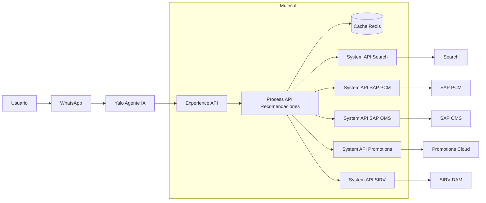
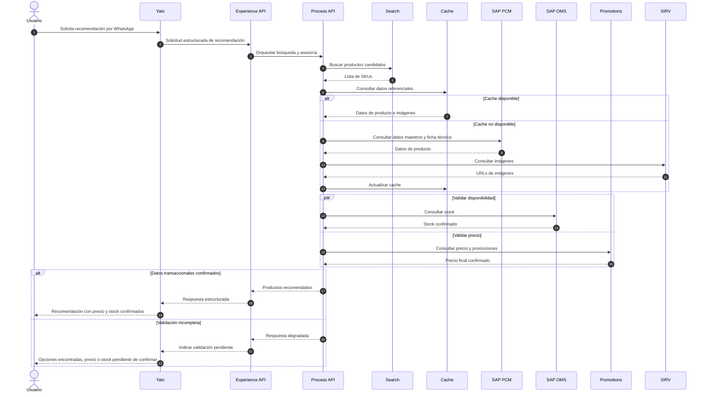

# Arquitectura de Solución para Asesoría Conversacional 24/7 vía WhatsApp

## Caso de Negocio: Entelgy

---

## 1. Resumen Ejecutivo

La solución propuesta habilita un canal de asesoría personalizada 24/7 por WhatsApp, soportado por Yalo como agente conversacional y Mulesoft como capa de integración y orquestación.

El objetivo es permitir que el cliente consulte productos en lenguaje natural, reciba recomendaciones comparables y obtenga información confiable de disponibilidad, precio y promociones.

La arquitectura se basa en tres principios:

- Baja latencia para una experiencia conversacional fluida.
- Precisión transaccional mediante consulta en tiempo real a SAP OMS y Promotions Cloud.
- Escalabilidad para crecer de 12.000 a 22.000 SKUs y habilitar fases futuras como pagos, pedidos y facturación.

---

## 2. Contexto del Negocio

La compañía busca evolucionar de un modelo donde el cliente busca productos manualmente hacia un modelo donde un agente de IA asesora, compara y recomienda.

WhatsApp será el canal de interacción. Yalo administrará la conversación, interpretará intención y contexto. Mulesoft desacoplará el canal de los sistemas internos y consolidará la información necesaria para responder.

La solución debe integrar datos de catálogo, imágenes, precio, promociones y stock sin exponer directamente los sistemas core al canal conversacional.

---

## 3. Arquitectura AS-IS

Actualmente la información del producto se encuentra distribuida en varios sistemas:

| Sistema | Responsabilidad | Consideración |
|---|---|---|
| Search | Búsqueda rápida por EAN, nombre, marca y precio referencial | Se actualiza por batch, no debe confirmar precio ni stock |
| SAP PCM | Datos maestros, descripciones, garantías y ficha técnica | Fuente principal de contenido de producto |
| SAP OMS | Inventario disponible en línea | Fuente oficial de stock |
| Promotions Cloud | Precio final y promociones | Fuente oficial de precio/promoción |
| SIRV | Imágenes y assets digitales | Fuente de URLs públicas optimizadas |
| Mulesoft | Integración y gestión de APIs | Capa habilitadora |
| Yalo | Agente conversacional | Canal inteligente de ventas |

Principales limitaciones:

- La información de producto está fragmentada.
- Consultar todos los sistemas en secuencia aumenta la latencia.
- Search puede estar desactualizado frente a OMS y Promotions.
- Los atributos técnicos varían por categoría.
- El crecimiento del catálogo exige una arquitectura escalable.

---

## 4. Arquitectura TO-BE

La arquitectura objetivo desacopla WhatsApp/Yalo de los sistemas internos mediante Mulesoft.

Yalo consume una Experience API especializada. Mulesoft orquesta el caso de uso mediante una Process API y abstrae cada backend mediante System APIs.

### Principios de diseño

| Principio | Aplicación |
|---|---|
| Desacoplamiento | Yalo no consume directamente SAP, Search, Promotions ni SIRV |
| API-Led Connectivity | Separación entre Experience API, Process API y System APIs |
| Baja latencia | Caché para datos referenciales de baja volatilidad |
| Precisión | Consulta en tiempo real para stock, precio y promociones |
| Modelo canónico | Respuesta unificada de Producto para Yalo |
| Evolución | Base preparada para pagos, pedidos y facturación |

Flujo conceptual:

1. El usuario escribe en WhatsApp.
2. Yalo interpreta intención y entidades.
3. Yalo invoca la Experience API.
4. Mulesoft consulta Search para obtener productos candidatos.
5. Mulesoft enriquece datos desde caché, SAP PCM y SIRV.
6. Mulesoft valida stock en SAP OMS y precio en Promotions Cloud.
7. Mulesoft consolida el modelo canónico.
8. Yalo responde al usuario en lenguaje conversacional.

---

## 5. Diagramas de Solución

### 5.1 Diagrama Lógico de Componentes



### 5.2 Diagrama de Secuencia: Búsqueda y Asesoría



---

## 6. Estrategia de Integración y Rendimiento

La integración se implementa con el patrón API-Led Connectivity:

| Capa | Responsabilidad |
|---|---|
| Experience API | Contrato optimizado para Yalo y WhatsApp |
| Process API | Orquestación de búsqueda, enriquecimiento y recomendación |
| System APIs | Abstracción de Search, SAP PCM, SAP OMS, Promotions y SIRV |

Para reducir latencia se aplican las siguientes tácticas:

- Consultar Search para obtener rápidamente productos candidatos.
- Usar caché distribuido para datos referenciales: descripción, ficha técnica, imágenes y categoría.
- Consultar en tiempo real SAP OMS y Promotions Cloud para validar stock y precio final.
- Ejecutar stock y precio en paralelo mediante scatter-gather.
- Aplicar timeouts y circuit breakers para proteger la experiencia conversacional.
- Usar respuesta degradada cuando no sea posible confirmar precio o disponibilidad.

El caché no se usa como fuente oficial para precio ni stock. Solo optimiza datos de baja volatilidad.

---

## 7. Modelo Canónico de Producto

La Experience API debe responder a Yalo con un modelo unificado, independiente del origen de los datos.

```json
{
  "product": {
    "sku": "LPT-98765",
    "ean": "7701234567890",
    "name": "Laptop Gamer Pro 15",
    "brand": "TechBrand",
    "category": "Laptops",
    "description": "Laptop de alto rendimiento para estudio, trabajo y gaming.",
    "imageUrl": "https://assets.sirv.com/lpt98765_main.jpg",
    "availability": {
      "storeId": "STORE-001",
      "status": "AVAILABLE",
      "quantity": 4
    },
    "pricing": {
      "currency": "COP",
      "listPrice": 5800000,
      "finalPrice": 4990000,
      "promotionApplied": true,
      "validUntil": "2026-05-31T23:59:59-05:00"
    },
    "search": {
      "score": 0.98,
      "matchedAttributes": ["ram", "storage"]
    },
    "specifications": {
      "ram": "16GB",
      "processor": "Intel Core i7",
      "storage": "1TB SSD"
    },
    "metadata": {
      "stockValidatedAt": "2026-05-18T10:02:15-05:00",
      "priceValidatedAt": "2026-05-18T10:02:15-05:00",
      "correlationId": "corr-789456123"
    }
  }
}
```

Este modelo oculta a Yalo la complejidad de los sistemas fuente. Search aporta relevancia, SAP PCM aporta datos maestros, SAP OMS confirma stock, Promotions Cloud confirma precio y SIRV aporta imágenes.

---

## 8. Gestión de Atributos Dinámicos

La ficha técnica se maneja mediante un campo flexible `specifications`, ya que los atributos cambian según la categoría.

Ejemplo laptop:

```json
{
  "ram": "16GB",
  "processor": "Intel Core i7",
  "storage": "1TB SSD"
}
```

Ejemplo nevera:

```json
{
  "capacityLiters": "420L",
  "coolingType": "No Frost",
  "energyEfficiency": "A"
}
```

Para evitar desorden, el modelo flexible debe estar gobernado por un diccionario de atributos por categoría.

El diccionario define:

- Atributos permitidos.
- Tipo de dato.
- Unidad de medida.
- Alias conversacionales.
- Relevancia para recomendación.

Ejemplo:

```json
{
  "categoryId": "CAT-LAPTOPS",
  "attributes": [
    {
      "key": "ram",
      "label": "Memoria RAM",
      "type": "string",
      "unit": "GB",
      "aliases": ["memoria", "ram", "memoria ram"],
      "searchable": true
    }
  ]
}
```

Recomendación: usar JSON flexible como contrato hacia Yalo y reservar EAV solo si se requiere persistencia analítica o reporting avanzado.

---

## 9. Seguridad

La solución debe aplicar defensa en profundidad desde el canal hasta los sistemas backend.

Controles principales:

| Capa | Controles |
|---|---|
| Canal | Validación de origen, sanitización de entradas y control de abuso |
| Yalo - Mulesoft | OAuth 2.0 Client Credentials, JWT, scopes y TLS 1.2+ |
| API Gateway | Rate limiting, throttling, validación de contratos y cuotas |
| Backend | Credenciales gestionadas, rotación de secretos y separación de ambientes |
| Datos personales | Enmascaramiento de PII, minimización de datos y retención controlada |

En futuras fases transaccionales, la arquitectura no debe almacenar datos sensibles de tarjetas. Los pagos deben delegarse a pasarelas certificadas mediante links o redirecciones seguras.

---

## 10. Observabilidad y Operación

Cada solicitud debe tener un Correlation ID propagado de punta a punta.

Métricas técnicas:

- Latencia end-to-end.
- Latencia por API.
- Tasa de error por sistema.
- Timeouts.
- Circuit breakers abiertos.
- Cache hit ratio.
- Throughput por endpoint.

Métricas funcionales:

- Búsquedas iniciadas.
- Recomendaciones entregadas.
- Respuestas degradadas.
- Consultas sin resultado.
- Productos sin stock.
- Conversaciones abandonadas.

Los logs deben registrar información útil para diagnóstico, sin exponer tokens, credenciales, datos personales o información de pago.

---

## 11. Visión de Futuro y Escalabilidad

La arquitectura queda preparada para evolucionar por fases:

| Fase | Capacidad | Preparación arquitectónica |
|---|---|---|
| Fase 1 | Búsqueda y asesoría | Experience API, Process API, System APIs y modelo canónico |
| Fase 2 | Métodos de pago | Payment System API y link de pago seguro |
| Fase 3 | Pedido en SAP | Order Process API, cola de mensajes e idempotencia |
| Fase 4 | Facturación electrónica | Billing API y eventos de pedido confirmado |
| Fase 5 | Postventa | Consulta de estado, garantías, devoluciones y notificaciones |

Para pedidos y facturación se recomienda procesamiento asíncrono y orientado a eventos, evitando bloquear la conversación de WhatsApp ante tiempos variables de SAP.

---

## 12. Conclusiones

La solución transforma un ecosistema fragmentado en una capacidad conversacional integrada.

Yalo se enfoca en la experiencia del usuario. Mulesoft desacopla, orquesta y gobierna la integración. Los sistemas core mantienen su responsabilidad como fuentes oficiales de catálogo, stock, precio, promociones e imágenes.

La arquitectura propuesta entrega:

- Baja latencia mediante caché de datos referenciales.
- Precisión transaccional mediante validación en tiempo real.
- Flexibilidad para atributos dinámicos por categoría.
- Seguridad en canal, APIs y datos personales.
- Observabilidad para operar el flujo de punta a punta.
- Escalabilidad para pagos, pedidos y facturación.

La recomendación es implementar primero el flujo de búsqueda y asesoría, medir latencia y precisión, y luego evolucionar hacia capacidades transaccionales mediante APIs desacopladas, eventos e idempotencia.
