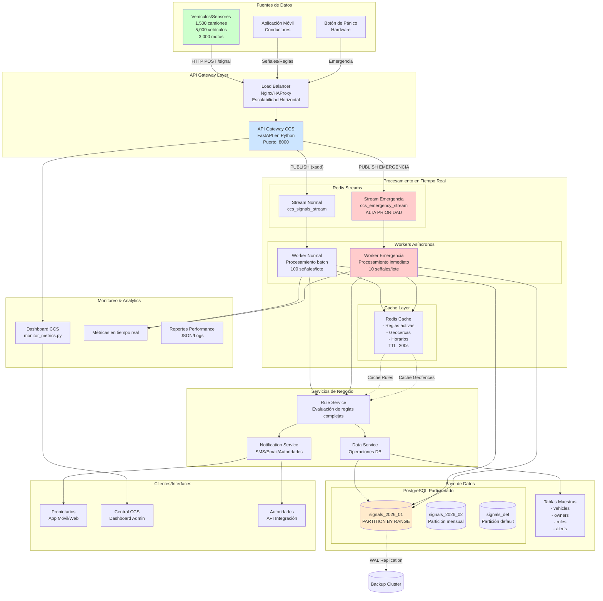

# Diagrama de Componentes - Arquitectura CCS

## Objetivo
Mostrar la arquitectura completa del sistema CCS con todos los componentes y sus interacciones, garantizando el procesamiento de 500 señales por segundo y respuesta a emergencias en menos de 2 segundos.

## Diagrama



## Componentes Clave

### 1. Fuentes de Datos
- **Vehículos/Sensores**: 1,500 camiones, 5,000 vehículos, 3,000 motos (crecimiento 20% anual)
- **Aplicación Móvil**: Para conductores y propietarios
- **Botón de Pánico**: Hardware de emergencia en cada vehículo

### 2. API Gateway Layer
- **FastAPI**: Framework Python asíncrono para alta concurrencia
- **Load Balancer**: Distribución de carga para escalabilidad horizontal
- **Validación**: Schema validation con Pydantic
- **Rate Limiting**: Control de 500 RPS sostenidos

### 3. Procesamiento en Tiempo Real
#### Redis Streams
- **Stream Normal**: `ccs_signals_stream` - Señales regulares
- **Stream Emergencia**: `ccs_emergency_stream` - Alta prioridad
- **Consumer Groups**: Procesamiento paralelo con garantías de entrega

#### Workers Asíncronos
- **Worker Normal**: Procesamiento batch (100 señales/lote)
- **Worker Emergencia**: Procesamiento inmediato (10 señales/lote)
- **Concurrencia**: Basado en asyncio para alto I/O

#### Cache Layer
- **Redis Cache**: Tiempos de acceso sub-milisegundo
- **Cache de Reglas**: TTL 300 segundos
- **Cache Geocercas/Horarios**: Para evaluación rápida

### 4. Base de Datos
#### PostgreSQL 15
- **Particionamiento**: Tabla `signals` particionada por rango de fecha (mensual)
- **Índices Optimizados**:
  - `idx_signals_vehicle_time`: (vehicle_id, timestamp DESC)
  - `idx_rules_vehicle_active`: Filtrado por vehículo y estado
- **Connection Pooling**: 100 conexiones máximas

#### Tablas Principales
- **vehicles**: Información vehicular y metadata
- **owners**: Dueños y contactos de emergencia
- **rules**: Reglas configurables por vehículo
- **alerts**: Histórico de alertas generadas
- **signals**: Señales particionadas (corazón del sistema)

### 5. Servicios de Negocio
- **Rule Service**: Evaluación de 8 tipos de reglas complejas
- **Notification Service**: Notificaciones multi-canal
- **Data Service**: Abstraction layer para operaciones DB

### 6. Monitoreo & Analytics
- **Dashboard CCS**: `monitor_metrics.py` con métricas en tiempo real
- **Métricas**: RPS, latencia, errores, cumplimiento SLA
- **Reportes**: JSON exportable para análisis posterior

### 7. Clientes/Interfaces
- **Propietarios**: App móvil/web para configuración y alertas
- **Central CCS**: Dashboard administrativo
- **Autoridades**: API para integración con sistemas externos

## Flujo de Datos

### Señal Normal
```
Vehículo → Load Balancer → API Gateway → Redis Stream Normal → Worker Normal → 
Cache Rules → Rule Service → PostgreSQL → Notification Service → Propietario
```

### Emergencia (<2s SLA)
```
Botón Pánico → Load Balancer → API Gateway → Redis Stream Emergencia → 
Worker Emergencia → PostgreSQL (fast insert) → Rule Service (solo PANIC_BUTTON) → 
Notification Service (inmediato) → Autoridades + Propietario
```

## Escalabilidad

### Horizontal
- **API Instancias**: Múltiples réplicas detrás de load balancer
- **Workers**: Pueden escalar independientemente según carga
- **Redis Cluster**: Para streams y cache distribuido

### Vertical
- **PostgreSQL Replicas**: Lecturas escaladas a réplicas
- **Redis Sentinel**: High availability con failover automático
- **Connection Pooling**: Conexiones optimizadas para alta concurrencia

## Métricas de Performance

### Objetivos
- **Throughput**: 500 señales/segundo sostenidos por 2 minutos
- **Latencia Emergencia**: < 2000ms (p95)
- **Disponibilidad**: 99.9% uptime
- **Cache Hit Rate**: > 90% para reglas activas

### Monitoreo
- **Health Checks**: Endpoint `/health` con estado de todos los componentes
- **Métricas en Tiempo Real**: Endpoint `/metrics` con estadísticas detalladas
- **Alertas Automáticas**: Para violaciones de SLA o degradación

## Decisiones de Diseño

### 1. Separación de Streams
Razón: Garantizar que emergencias no esperen detrás de señales normales.

### 2. Cache Estratégico
Razón: Reducir carga en PostgreSQL para consultas frecuentes.

### 3. Particionamiento Mensual
Razón: Mejorar performance de queries recientes y facilitar retención.

### 4. Procesamiento Asíncrono
Razón: Optimizar para operaciones I/O intensivas (Redis, PostgreSQL, HTTP).

## Consideraciones de Crecimiento

### Proyección 3 Años (20% anual)
- **Año 1**: 9,500 vehículos
- **Año 2**: 11,400 vehículos  
- **Año 3**: 13,680 vehículos

### Escalabilidad Planificada
- **Redis Cluster**: A partir de 20,000 vehículos
- **PostgreSQL Sharding**: Por región geográfica
- **Microservicios**: Separar servicios según carga

---

**Archivo:** `docs/architecture/01_component_diagram.md`  
**Versión:** 1.0  
**Última actualización:** Enero 2024  
**Responsable:** Equipo de Arquitectura CCS