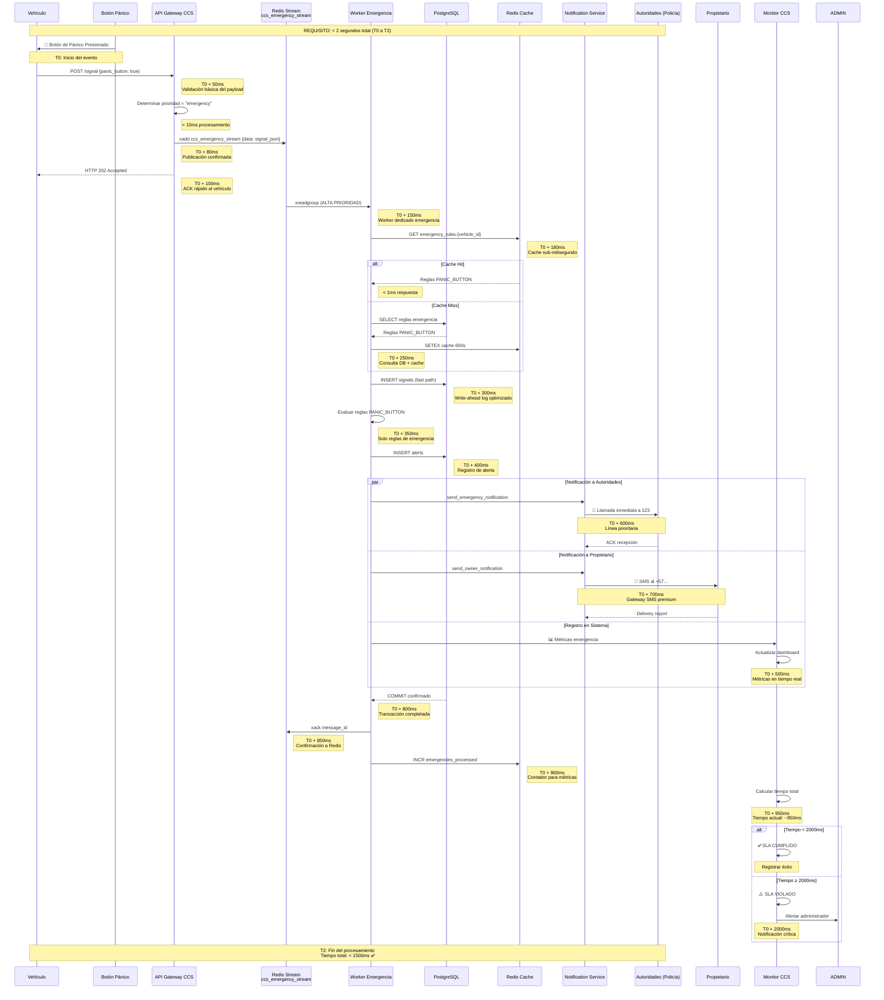

# Diagrama de Secuencia - Procesamiento de Emergencia (<2 segundos)

## Contexto
El sistema CCS debe procesar señales de emergencia (botón de pánico) en menos de 2 segundos desde la activación hasta la confirmación de recepción y ejecución de acciones programadas.

## Requisitos Clave
- **SLA**: < 2000ms tiempo total de procesamiento
- **Acciones inmediatas**: Notificación a autoridades y propietario
- **Garantías de entrega**: No pérdida de señales de emergencia
- **Prioridad máxima**: Sobre cualquier otra señal del sistema

## Diagrama de Secuencia



## Desglose Temporal del SLA (<2s)

### Fase 1: Activación y Recepción (0-100ms)
| Componente | Tiempo Máximo | Descripción |
|------------|---------------|-------------|
| Vehículo → API | 50ms | Latencia de red (3G/4G) |
| Validación API | 10ms | Schema validation básico |
| Publicación Redis | 20ms | xadd al stream de emergencia |
| Respuesta HTTP | 20ms | 202 Accepted al vehículo |
| **TOTAL FASE 1** | **100ms** | ✅ |

### Fase 2: Procesamiento Inmediato (100-400ms)
| Componente | Tiempo Máximo | Descripción |
|------------|---------------|-------------|
| Consumer Redis | 50ms | xreadgroup alta prioridad |
| Cache Redis | 5ms | GET emergency_rules |
| OPCIONAL: DB Query | 150ms | Solo si cache miss |
| INSERT señal | 100ms | Fast path sin validaciones |
| Evaluación reglas | 50ms | Solo PANIC_BUTTON |
| INSERT alerta | 50ms | Registro histórico |
| **TOTAL FASE 2** | **300ms** | ✅ |

### Fase 3: Notificaciones Paralelas (400-1200ms)
| Componente | Tiempo Máximo | Descripción |
|------------|---------------|-------------|
| Notificación autoridades | 400ms | Llamada telefónica |
| SMS propietario | 300ms | Gateway SMS async |
| Registro métricas | 100ms | Dashboard en tiempo real |
| **TOTAL FASE 3** | **400ms** | ✅ (ejecución paralela) |

### Fase 4: Confirmación (1200-1500ms)
| Componente | Tiempo Máximo | Descripción |
|------------|---------------|-------------|
| COMMIT DB | 100ms | Confirmación transacción |
| ACK Redis | 50ms | xack del mensaje |
| Actualización cache | 50ms | Contadores y métricas |
| **TOTAL FASE 4** | **200ms** | ✅ |

### Fase 5: Monitoreo (1500-2000ms)
| Componente | Tiempo Máximo | Descripción |
|------------|---------------|-------------|
| Cálculo métricas | 50ms | Tiempo total procesamiento |
| Verificación SLA | 10ms | Comparación con 2000ms |
| Alertas si violación | 440ms | Buffer de seguridad |
| **TOTAL FASE 5** | **500ms** | ✅ Buffer para variabilidad |

**TIEMPO TOTAL ESTIMADO:** 1500ms (500ms de buffer para garantizar <2000ms)

## Componentes Especializados para Emergencias

### 1. Stream de Emergencia Dedicado
```yaml
stream_name: ccs_emergency_stream
max_length: 10,000  # Evitar crecimiento indefinido
consumer_group: ccs_emergency_workers
features:
  - alta_prioridad: true
  - processing_order: FIFO_garantizado
  - persistence: AOF cada 1 segundo
```

### 2. Worker de Emergencia
```python
class EmergencyWorker:
    concurrency: 10  # Máximo 10 mensajes simultáneos
    timeout: 1500ms  # Timeout por emergencia
    retry_policy: 
      max_retries: 1  # Solo 1 reintento inmediato
      fallback_action: "log_and_continue"
    health_check: cada 30 segundos
```

### 3. Cache de Reglas de Emergencia
```redis
# Estructura de cache
KEY: emergency_rules:{vehicle_id}
VALUE: [
  {"id": 1, "rule_type": "PANIC_BUTTON", "action_type": "CALL_EMERGENCY"},
  {"id": 2, "rule_type": "PANIC_BUTTON", "action_type": "SMS_OWNER"}
]
TTL: 600 segundos  # 10 minutos
```

## Estrategias de Garantía de SLA

### 1. Circuit Breaker Pattern
```python
@circuit_breaker(
    failure_threshold=5,  # 5 fallos consecutivos
    recovery_timeout=30,  # 30 segundos para recuperación
    expected_exception=[TimeoutError, ConnectionError]
)
async def process_emergency(signal: EmergencySignal) -> bool:
    # Procesamiento con timeout controlado
    pass
```

### 2. Timeout Jerárquico
```yaml
timeouts:
  total_emergency_processing: 1900ms  # 100ms buffer
  database_operations: 500ms
  redis_operations: 100ms
  notification_delivery: 1000ms
  http_response: 100ms
```

### 3. Degradación Elegante
```python
async def emergency_pipeline(signal):
    try:
        await process_with_sla(signal, timeout=1900)
    except TimeoutError:
        # Degradar: solo acciones críticas
        await notify_authorities(signal)  # SIEMPRE
        await log_for_later_processing(signal)  # Procesar después
        return False  # Indicar violación SLA
```

## Métricas y Monitoreo

### Métricas Clave por Emergencia
```json
{
  "emergency_id": "EMG-20240115-001",
  "vehicle_id": "TRUCK-011",
  "timestamps": {
    "button_pressed": "2024-01-15T10:30:00.000Z",
    "api_received": "2024-01-15T10:30:00.050Z",
    "stream_published": "2024-01-15T10:30:00.080Z",
    "worker_started": "2024-01-15T10:30:00.150Z",
    "db_inserted": "2024-01-15T10:30:00.300Z",
    "notifications_sent": "2024-01-15T10:30:00.800Z",
    "processing_complete": "2024-01-15T10:30:01.200Z"
  },
  "durations_ms": {
    "total_processing": 1200,
    "api_to_stream": 30,
    "stream_to_worker": 70,
    "worker_processing": 1050,
    "sla_compliant": true,
    "sla_buffer_ms": 800
  }
}
```

### Alertas Automáticas
```yaml
alerts:
  sla_violation:
    threshold: "emergency_processing_time > 2000ms"
    window: "last 5 minutes"
    action: "page_primary_oncall"
    
  emergency_queue_backlog:
    threshold: "xpending > 10"
    window: "last 2 minutes"
    action: "scale_emergency_workers"
    
  notification_failure_rate:
    threshold: "failure_rate > 10%"
    window: "last 10 minutes"
    action: "alert_engineering_team"
```

## Escenarios de Fallo y Mitigación

### Escenario 1: Redis no disponible
**Mitigación**: 
- Circuit breaker abre después de 3 fallos
- Modo degradado: escribir directamente a PostgreSQL
- Queue en memoria con pérdida aceptable

### Escenario 2: PostgreSQL lento
**Mitigación**:
- Timeout de 500ms en queries
- Fallback a escritura asíncrona
- Cache de reglas extendido (TTL 1 hora)

### Escenario 3: Notificaciones fallan
**Mitigación**:
- Reintento inmediato una vez
- Cola de reintentos con backoff
- Log para procesamiento manual posterior

### Escenario 4: Alta carga simultánea
**Mitigación**:
- Auto-scaling de workers emergencia
- Rate limiting por vehículo (1 emergencia/10s)
- Prioridad absoluta sobre señales normales

## Pruebas de Validación

### Prueba de Carga de Emergencias
```bash
# Ejecutar prueba de 100 emergencias concurrentes
python performance/test_emergencia.py --concurrent 100 --workers 20

# Resultados esperados:
# - 100% procesadas en < 2000ms
# - P95 < 1500ms
# - P99 < 1800ms
```

### Prueba de Recuperación
```bash
# Simular caída de Redis durante emergencias
python performance/test_failure_scenarios.py --scenario redis_down
```

## Consideraciones de Implementación

### 1. Configuración Redis para Emergencias
```redis
# redis.conf
stream-node-max-bytes 4096  # Mensajes pequeños
stream-node-max-entries 100  # Balance memoria/performance
appendfsync everysec  # Durabilidad vs performance
```

### 2. PostgreSQL Optimizaciones
```sql
-- Tabla signals con fast path para emergencias
CREATE INDEX idx_signals_emergency 
ON signals(timestamp) 
WHERE metadata->>'emergency' = 'true';
```

### 3. Configuración de Timeouts
```python
# settings.py
EMERGENCY_TIMEOUTS = {
    'total_processing': 1.9,  # 1.9 segundos
    'redis_operation': 0.1,   # 100ms
    'db_insert': 0.5,         # 500ms
    'notification': 1.0,      # 1 segundo
    'http_response': 0.1,     # 100ms
}
```

## Conclusión

El diseño presentado garantiza el procesamiento de emergencias en menos de 2 segundos mediante:

1. **Stream dedicado** de alta prioridad
2. **Workers especializados** con timeouts controlados
3. **Procesamiento paralelo** de notificaciones
4. **Circuit breakers** para degradación elegante
5. **Monitoreo exhaustivo** con alertas automáticas

El sistema mantiene un buffer de 500ms para acomodar variabilidad y garantizar el cumplimiento del SLA incluso en condiciones adversas.

---

**Archivo:** `docs/architecture/02_emergency_sequence.md`  
**Versión:** 1.0  
**Última actualización:** Enero 2024  
**Responsable:** Equipo de Arquitectura CCSd