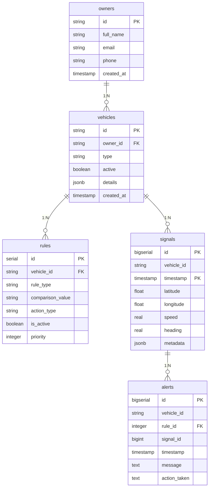

# CCS - Central de Seguimiento Vehicular
## Arquitectura de Datos de Referencia

> **Documento Técnico**: Estructuras de datos en PostgreSQL y Redis  
> **Versión**: 2.1 | **Última revisión**: $(date)  
> **Responsable**: Arquitecto de Datos  
> **Audiencia**: Data Engineers, Backend Developers, DBAs  

---

## 1. VISIÓN GENERAL

### 1.1 Stack Tecnológico de Datos
```
┌─────────────────┐    ┌─────────────────┐
│   PostgreSQL    │    │     Redis       │
│   (NeonDB)      │    │   (Upstash)     │
├─────────────────┤    ├─────────────────┤
│ • Source of Truth │  │ • Cache Layer   │
│ • Histórico      │  │ • Hot Data      │
│ • Reporting      │  │ • Session State │
│ • ACID           │  │ • High Speed    │
└────────┬────────┘    └────────┬────────┘
         │                      │
         └──────────────────────┘
                API FastAPI
```

### 1.2 Principios de Diseño
| Principio | PostgreSQL | Redis | Justificación |
|-----------|------------|-------|---------------|
| **Consistencia** | ACID Completo | Eventual | Alertas toleran retrasos |
| **Disponibilidad** | 99.9% | 99.95% | Redis fallback a PostgreSQL |
| **Latencia** | 100-200ms (P95) | <50ms | Cache para reglas críticas |
| **Durabilidad** | Persistente | Volátil + TTL | Redis es cache, no storage |

---

## 2. POSTGRESQL - ESQUEMA RELACIONAL

### 2.1 Diagrama Entidad-Relación


### 2.2 Diccionario de Datos PostgreSQL

#### Tabla: `signals` (Particionada - Núcleo del Sistema)
| Columna | Tipo | Nullable | Descripción | Índices |
|---------|------|----------|-------------|---------|
| `id` | BIGSERIAL | NO | Auto-incremental | PK (compuesta) |
| `vehicle_id` | VARCHAR(20) | NO | ID vehículo fuente | `idx_signals_vehicle_time` |
| `timestamp` | TIMESTAMPTZ | NO | **Particionamiento** | PK (compuesta) |
| `latitude` | DOUBLE PRECISION | NO | GPS Latitud (-90 a 90) | - |
| `longitude` | DOUBLE PRECISION | NO | GPS Longitud (-180 a 180) | - |
| `speed` | REAL | YES | km/h (DEFAULT 0.0) | - |
| `heading` | REAL | YES | Dirección en grados (0-360) | - |
| `metadata` | JSONB | YES | Datos variables por señal | - |

**Estrategia de Particionamiento:**
```sql
-- Tabla padre (declarativa)
CREATE TABLE signals (...) PARTITION BY RANGE (timestamp);

-- Particiones actuales
signals
├── signals_2026_01 (Enero 2026)
├── signals_2026_02 (Febrero 2026)
└── signals_def (default - catch-all)
```

#### Tabla: `alerts` (Histórico de Eventos)
| Columna | Tipo | Nullable | Descripción | Índices |
|---------|------|----------|-------------|---------|
| `signal_id` | BIGINT | **YES** | **NULLABLE por diseño** | `idx_alerts_signal` |
| `rule_id` | INT | YES | FK a regla que activó alerta | - |
| `vehicle_id` | VARCHAR(20) | NO | Para reporting rápido | `idx_alerts_vehicle_time` |

**Decisión de diseño**: `signal_id` puede ser NULL para permitir creación de alertas incluso si falla la inserción de señal (trade-off disponibilidad vs. consistencia).

#### Tabla: `rules` (Motor de Reglas - Índice Parcial Crítico)
```sql
-- Índice optimizado para failover de cache
CREATE INDEX idx_rules_vehicle_active ON rules(vehicle_id) 
WHERE is_active = TRUE;  -- Reduce tamaño ~80%
```

### 2.3 Estructuras JSONB Estándar

#### `vehicles.details` (Metadatos por Tipo de Vehículo)
```json
// CAMIÓN (TRUCK) - Estándar
{
  "capacity": "30ton",
  "brand": "Kenworth",
  "gps_model": "X1"
}

// CAMIÓN REFRIGERADO (TRUCK - Reefer)
{
  "type": "reefer",
  "temp_min": -20,
  "brand": "ThermoKing"
}

// TAXI (CAR - Taxi)
{
  "color": "yellow",
  "brand": "Kia",
  "model": "Picanto"
}

// MOTO DOMICILIOS (MOTO - Delivery)
{
  "cc": 150,
  "brand": "Yamaha",
  "box": "Rappi"
}
```

#### `signals.metadata` (Eventos en Tiempo Real)
```json
// SENSOR DE TEMPERATURA (Camión refrigerado)
{
  "cargo_temp": -12.5
}

// BOTÓN DE PÁNICO (Taxis)
{
  "panic_button": true
}

// ESTADO DE PUERTAS (Camiones de carga)
{
  "door_status": "open"
}
```

### 2.4 Índices Críticos PostgreSQL
```sql
-- 1. Para failover cuando Redis cae (lectura crítica)
CREATE INDEX idx_rules_vehicle_active ON rules(vehicle_id) 
WHERE is_active = TRUE;

-- 2. Para acceso a señales por vehículo + tiempo
CREATE INDEX idx_signals_vehicle_time ON signals(vehicle_id, timestamp DESC);

-- 3. Para reporting de alertas
CREATE INDEX idx_alerts_vehicle_time ON alerts(vehicle_id, timestamp DESC);
CREATE INDEX idx_alerts_signal ON alerts(signal_id);  -- JOIN con signals

-- 4. Para consultas comunes
CREATE INDEX idx_vehicles_owner ON vehicles(owner_id);
```

---

## 3. REDIS - ESQUEMA DE CACHÉ

### 3.1 Modelo de Datos Redis
```
Redis como Cache-Aside Layer:
┌─────────────────────────────────────────────────────────────┐
│                        REDIS NAMESPACE                      │
│  rules:{vehicle_id}  →  [JSON Array de reglas activas]      │
│                      │  TTL: 300s (5 minutos)               │
│                                                             │
│  circuit:status      →  "open"|"closed"                     │
│                      │  (circuit breaker state)             │
└─────────────────────────────────────────────────────────────┘
```

### 3.2 Estructuras de Claves y Valores

#### **Clave Principal: `rules:{vehicle_id}`**
```json
// Formato del valor (JSON Array)
[
  {
    "id": 12,
    "rule_type": "MAX_SPEED",
    "comparison_value": "80.0",
    "action_type": "NOTIFY_POLICE",
    "priority": 1
  },
  {
    "id": 13,
    "rule_type": "DOOR_SENSOR",
    "comparison_value": "OPEN",
    "action_type": "NOTIFY_OWNER",
    "priority": 2
  }
]
```

**Configuración por clave:**
```python
# En aplicación FastAPI
await redis.setex(
    f"rules:{vehicle_id}",  # Clave
    300,                    # TTL: 300 segundos (5 minutos)
    json.dumps(reglas)      # Valor: JSON serializado
)
```

#### **Claves de Estado del Sistema**
| Clave | Tipo | Valor | Descripción |
|-------|------|-------|-------------|
| `circuit:status` | String | `"open"` o `"closed"` | Estado circuit breaker Redis |
| `ccs:metrics:hit_rate` | String | `"94.5"` | Porcentaje cache hit rate |
| `ccs:last_failure` | String | ISO timestamp | Último fallo Redis registrado |

### 3.3 Patrones de Acceso Redis

#### **Flujo de Lectura (Cache-Aside):**
```
1. GET rules:{vehicle_id}              ← Intenta Redis primero (timeout: 500ms)
   ↓ Hit? → Return JSON
   ↓ Miss? → 
2. SELECT FROM rules WHERE vehicle_id = ? AND is_active = TRUE
   ↓ Success? →
3. SETEX rules:{vehicle_id} 300 {JSON} ← Repoblar cache async (timeout: 300ms)
```

#### **Flujo de Invalidación:**
```python
# Cuando se actualiza una regla
await redis.delete(f"rules:{vehicle_id}")  # Invalidación inmediata

# Timeout para operación de delete
try:
    await asyncio.wait_for(
        redis.delete(f"rules:{vehicle_id}"),
        timeout=0.3  # 300ms máximo
    )
except asyncio.TimeoutError:
    logger.warning(f"Timeout invalidando cache para {vehicle_id}")
```

### 3.4 Configuración Redis (Upstash)
```python
# Configuración en aplicación
state.redis = Redis.from_url(
    os.getenv("REDIS_URL"),
    decode_responses=True,      # Strings en lugar de bytes
    socket_timeout=2,           # 2 segundos máximo por operación
    socket_connect_timeout=2,   # 2 segundos para conectar
    retry_on_timeout=True,      # Reintentar en timeout
    max_connections=50          # Pool de conexiones
)
```

---

## 4. RELACIÓN POSTGRESQL ↔ REDIS

### 4.1 Responsabilidades por Capa
| Responsabilidad | PostgreSQL | Redis | Justificación |
|-----------------|------------|-------|---------------|
| **Source of Truth** | ✅ Primario | ❌ Cache | PostgreSQL es autoritativo |
| **Reglas Activas** | ✅ Almacenamiento | ✅ Caché | Redis para baja latencia |
| **Datos Históricos** | ✅ Completo | ❌ Ninguno | Redis es volátil |
| **Estado de Sesión** | ❌ No aplica | ✅ Óptimo | Redis para estado efímero |

### 4.2 Estrategia de Consistencia
```
Escritura en PostgreSQL → Invalidación en Redis → Lectura eventualmente consistente

1. UPDATE rules SET ... WHERE vehicle_id = 'TRUCK-001';
2. DELETE rules:TRUCK-001  (en Redis)
3. Próxima lectura: Cache miss → SELECT FROM rules → SETEX nuevo valor
```

### 4.3 Circuit Breaker Pattern
```python
# Estado global en aplicación
state.redis_enabled = True  # Circuit cerrado por defecto

# Cuando Redis falla (timeout o error)
state.redis_enabled = False  # Circuit abierto - fallback a PostgreSQL

# Restauración manual o automática
@app.post("/redis/enable")
async def enable_redis():
    state.redis_enabled = True
    return {"status": "success", "message": "Redis re-enablado"}
```

---

## 5. ESTIMACIONES DE CRECIMIENTO

### 5.1 Volumen de Datos
| Entidad | Registros Test | Crecimiento Estimado | Storage (Año 1) |
|---------|---------------|----------------------|-----------------|
| `owners` | 20 | 5-10% mensual | < 10 MB |
| `vehicles` | 70 | 10-20% mensual | ~ 50 MB |
| `rules` | 90+ | 5-10% mensual | ~ 100 MB |
| `signals` | 1,000+ | **500/seg = 1.5B/año** | ~ 500 GB |
| `alerts` | 50+ | ~10% de señales | ~ 50 GB |

### 5.2 Memoria Redis Requerida
```
Cálculo de memoria Redis:
- Reglas por vehículo: ~5 en promedio
- Tamaño por regla JSON: ~150 bytes
- Vehículos activos: ~500 (estimado)
- Total: 500 × 5 × 150 = ~375 KB
- Más overhead: ~1 MB total

TTL: 300 segundos → Rotación completa cada 5 minutos
```

---

## 6. MIGRACIONES Y EVOLUCIÓN

### 6.1 Cambios de Esquema PostgreSQL
```sql
-- Ejemplo: Agregar nueva columna a alerts
ALTER TABLE alerts ADD COLUMN severity VARCHAR(20) DEFAULT 'medium';

-- Para particiones, agregar a tabla padre se propaga a hijas
ALTER TABLE signals ADD COLUMN battery_level SMALLINT;
```

### 6.2 Migración de Datos Redis
```bash
# En caso de migración/upgrade de Redis
# 1. Exportar claves críticas
redis-cli --scan --pattern "rules:*" | while read key; do
  redis-cli --raw DUMP "$key" > "backup/$key.rdb"
done

# 2. Importar en nuevo cluster
cat backup/rules:TRUCK-001.rdb | redis-cli -x RESTORE rules:TRUCK-001 0
```

---

## 7. MONITOREO Y HEALTH CHECKS

### 7.1 Métricas Clave PostgreSQL
```sql
-- Health check rápido
SELECT 
  (SELECT COUNT(*) FROM signals WHERE timestamp > NOW() - INTERVAL '5 minutes') as signals_5min,
  (SELECT COUNT(*) FROM pg_stat_activity WHERE state = 'active') as active_connections,
  (SELECT pg_size_pretty(pg_database_size(current_database()))) as db_size;
```

### 7.2 Métricas Clave Redis
```bash
# Comandos de monitoreo
redis-cli INFO memory          # Uso de memoria
redis-cli INFO stats           # Estadísticas generales
redis-cli INFO keyspace        # Claves por base de datos

# Cache hit rate (desde aplicación)
hit_rate = (cache_hits / (cache_hits + cache_misses)) * 100
```

### 7.3 Alertas Configuradas
| Métrica | Umbral | Acción |
|---------|--------|--------|
| `redis_hit_rate` | < 80% | Warning: Cache inefectivo |
| `postgres_active_connections` | > 80 | Warning: Pool cerca de límite |
| `signals_insert_timeout_rate` | > 5% | Critical: PostgreSQL lento |
| `redis_circuit_open` | > 5 minutos | Critical: Redis caído |

---

## 8. RESPONSABILIDADES Y CONTACTOS

| Rol | Responsabilidad PostgreSQL | Responsabilidad Redis | Contacto |
|-----|---------------------------|-----------------------|----------|
| **Arquitecto de Datos** | Diseño esquema, índices, particiones | Estructura claves, TTLs | @datateam |
| **DBA** | Mantenimiento, backups, tuning | - | @dba-team |
| **DevOps** | Despliegue NeonDB, conexiones | Despliegue Upstash, monitoreo | @infra-team |
| **Backend Lead** | Patrones acceso, timeouts | Circuit breaker, fallback | @backend-team |

---

**📄 Documentación Relacionada:**
- [CCS_SYSTEM_FLOWS.md](./CCS_SYSTEM_FLOWS.md) - Flujos de datos en runtime
- [CCS_PERFORMANCE_BASELINE.md](./CCS_PERFORMANCE_BASELINE.md) - Métricas y SLAs
- [CCS_API_REFERENCE.md](./CCS_API_REFERENCE.md) - Endpoints y contratos

**🔗 Enlaces de Operación:**
- [NeonDB Console](https://console.neon.tech) - PostgreSQL management
- [Upstash Console](https://console.upstash.com) - Redis metrics and monitoring
- [Grafana Dashboard](https://grafana.internal/ccs) - Métricas consolidadas
