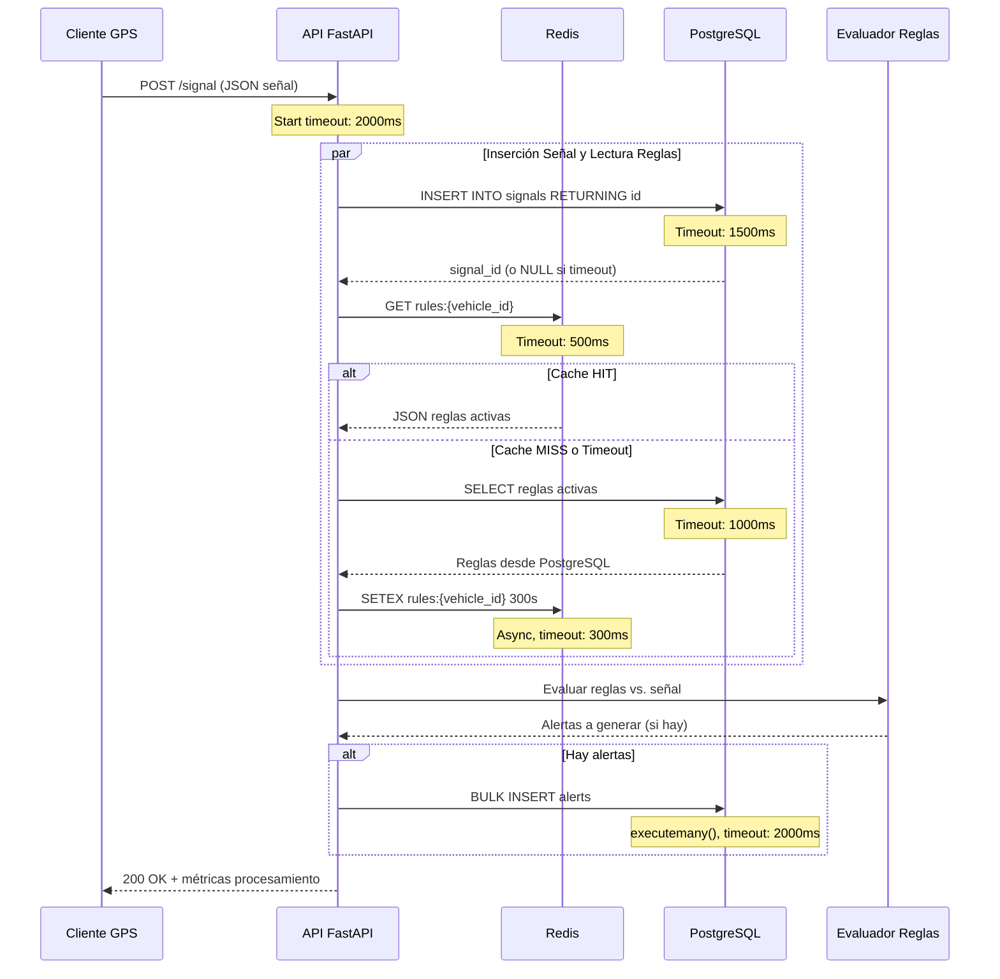
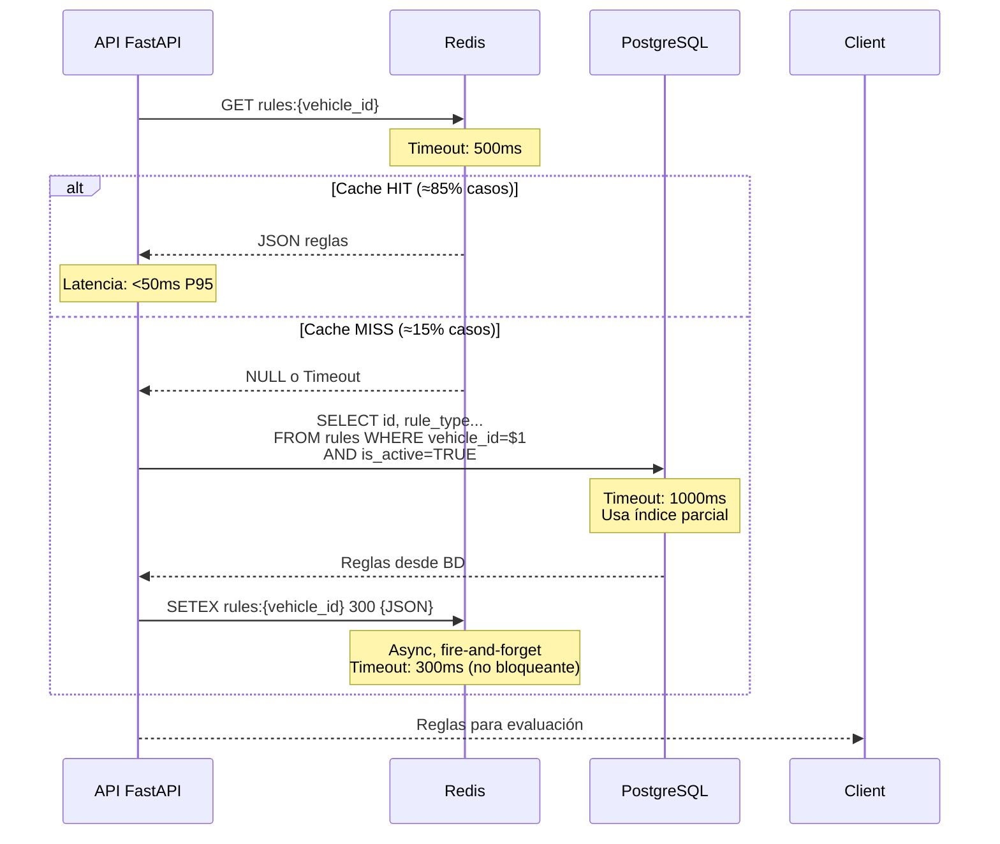
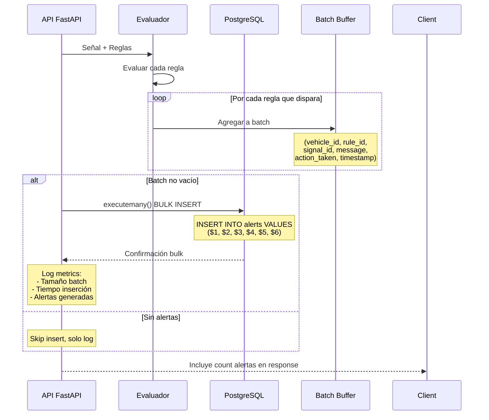
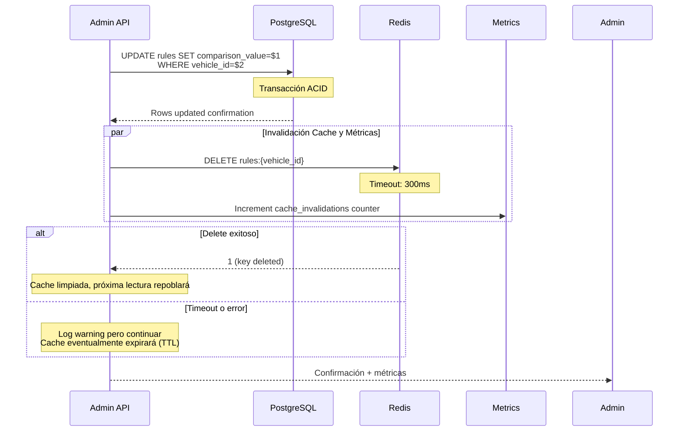

# CCS - Central de Seguimiento Vehicular
## Flujos del Sistema en Tiempo de Ejecución

> **Documento Técnico**: Flujos de datos, secuencias y patrones de acceso  
> **Versión**: 2.1 | **Última revisión**: $(date)  
> **Responsable**: Backend Engineering Lead  
> **Audiencia**: Backend Developers, DevOps, SREs  

---

## 1. VISIÓN GENERAL DE FLUJOS

### 1.1 Los 3 Flujos Principales del Sistema
```
1. 🚀 FLUJO DE INGESTA (POST /signal)
   Señal GPS → Validación → Redis/PostgreSQL → Alertas → Respuesta

2. 🔄 FLUJO DE LECTURA (GET rules)
   API → Redis (Cache-Aside) → Fallback PostgreSQL → Respuesta

3. ⚡ FLUJO DE ALERTAS (Bulk Processing)
   Evaluación Reglas → Bulk Insert → Confirmación
```

### 1.2 Timeouts y Límites por Capa
| Capa | Timeout Operación | Límite Conexiones | Circuit Breaker |
|------|-------------------|-------------------|-----------------|
| **API FastAPI** | 2s total request | 1000 concurrent | N/A |
| **Redis (Upstash)** | 500ms por operación | 50 pool | ✅ Activo |
| **PostgreSQL (Neon)** | 1.5s por query | 100 pool | ✅ Fallback |

---

## 2. 🚀 FLUJO 1: INGESTA DE SEÑALES

### 2.1 Diagrama de Secuencia (POST /signal)


### 2.2 Código de Referencia - Ingesta Principal
```python
@app.post("/signal")
async def procesar_señal(senal: Signal):
    start_time = datetime.now()
    
    try:
        # ✅ EJECUCIÓN PARALELA: Insertar señal Y obtener reglas
        async with state.pool.acquire() as conn:
            insert_task = asyncio.wait_for(
                conn.fetchval("INSERT INTO signals ... RETURNING id"),
                timeout=1.5
            )
            
            rules_task = obtener_reglas(senal.vehicle_id)  # Cache-Aside
            
            try:
                signal_id, reglas = await asyncio.gather(insert_task, rules_task)
            except asyncio.TimeoutError:
                # Si INSERT timeout, continuar sin signal_id
                signal_id = None
                reglas = await rules_task  # Aún obtener reglas
    except Exception as e:
        # Log error pero responder rápido
        return {"status": "error", "processing_time_ms": ...}
```

### 2.3 Decisiones de Diseño - Flujo Ingesta

#### **Paralelismo Crítico:**
```python
# EN SERIE (NO hacer):
signal_id = await insert_signal()  # 1.5s
reglas = await get_rules()         # 0.5-1s
# Total: ~2.0s

# EN PARALELO (Implementado):
signal_id, reglas = await asyncio.gather(
    insert_signal(),  # 1.5s máximo
    get_rules()       # 0.5-1s máximo
)
# Total: ~1.5s (mejor caso)
```

#### **Tolerancia a Fallos:**
| Componente | Comportamiento en Fallo | Impacto |
|------------|-------------------------|---------|
| **Redis cae** | Circuit breaker → PostgreSQL directo | Latencia +100ms |
| **PostgreSQL lento** | Timeout → signal_id = NULL | Alerta sin link a señal |
| **Ambos caen** | Reglas vacías → Solo inserción señal | Sistema degradado |

---

## 3. 🔄 FLUJO 2: LECTURA DE REGLAS (CACHE-ASIDE)

### 3.1 Diagrama de Secuencia - Cache-Aside Pattern


### 3.2 Implementación Cache-Aside
```python
async def obtener_reglas(vehicle_id: str) -> List[Dict]:
    """Obtiene reglas con timeout agresivo y circuit breaker."""
    clave_redis = f"rules:{vehicle_id}"
    
    # ✅ INTENTAR REDIS PRIMERO (500ms timeout)
    if state.redis_enabled:
        try:
            datos_cache = await asyncio.wait_for(
                state.redis.get(clave_redis),
                timeout=0.5
            )
            if datos_cache:
                logger.debug(f"✅ CACHE HIT: {vehicle_id}")
                return json.loads(datos_cache)
                
        except asyncio.TimeoutError:
            logger.warning("Redis timeout, abriendo circuit breaker")
            state.redis_enabled = False  # 🔥 Circuit se abre
    
    # ✅ CACHE MISS: Ir a PostgreSQL
    logger.info(f"💨 CACHE MISS/FAILOVER: {vehicle_id} -> PostgreSQL")
    
    query = """
        SELECT id, rule_type, comparison_value, action_type, priority
        FROM rules 
        WHERE vehicle_id = $1 AND is_active = TRUE
        ORDER BY priority DESC
    """
    
    try:
        async with state.pool.acquire() as conn:
            filas = await asyncio.wait_for(
                conn.fetch(query, vehicle_id),
                timeout=1.0  # 1s máximo para query
            )
    except asyncio.TimeoutError:
        logger.error(f"❌ Timeout PostgreSQL para {vehicle_id}")
        return []  # Mejor vacío que error
    
    reglas = [dict(fila) for fila in filas]
    
    # ✅ REINTENTAR CACHE (si Redis vuelve)
    if reglas and state.redis_enabled:
        try:
            # Async, no bloqueante
            asyncio.create_task(
                state.redis.setex(
                    clave_redis, 
                    300, 
                    json.dumps(reglas, default=str)
                )
            )
        except:
            pass  # No crítico si falla cache write
    
    return reglas
```

### 3.3 Estadísticas de Performance Cache

#### **Hit Rate Esperado:**
```
Supuestos:
- TTL Redis: 300 segundos (5 minutos)
- Mismo vehículo envía señales cada 30 segundos
- Cálculo: 10 señales dentro de TTL → 9 cache hits, 1 miss

Hit Rate = 9 / 10 = 90%

En producción objetivo: >85% hit rate
```

#### **Métricas de Monitoreo:**
```python
# En respuesta /signal
return {
    "status": "processed",
    "cache_status": cache_status,  # "hit", "miss", "timeout", "error"
    "processing_time_ms": round(processing_time, 2),
    "reglas_evaluadas": len(reglas),
    # ...
}
```

---

## 4. ⚡ FLUJO 3: GENERACIÓN DE ALERTAS (BULK PROCESSING)

### 4.1 Diagrama de Secuencia - Bulk Insert


### 4.2 Implementación Bulk Insert
```python
# Patrón: Acumular y luego insertar por lotes
alertas_a_insertar = []  # Buffer para bulk insert

for regla in reglas:
    if evaluar_regla(regla, senal):  # MAX_SPEED, PANIC_BUTTON, etc.
        alertas_a_insertar.append((
            senal.vehicle_id, 
            regla["id"],
            signal_id,  # Puede ser NULL
            f"Alerta {regla['rule_type']} para {senal.vehicle_id}",
            regla["action_type"],
            senal.timestamp
        ))

# ✅ BULK INSERT (si hay alertas)
if alertas_a_insertar:
    try:
        async with state.pool.acquire() as conn:
            await conn.executemany("""
                INSERT INTO alerts 
                (vehicle_id, rule_id, signal_id, message, action_taken, timestamp)
                VALUES ($1, $2, $3, $4, $5, $6)
            """, alertas_a_insertar)
            
            logger.debug(f"📊 Bulk insert: {len(alertas_a_insertar)} alertas")
            
    except asyncio.TimeoutError:
        logger.error("❌ Timeout insertando alertas (batch perdido)")
    except Exception as e:
        logger.error(f"❌ Error bulk insert: {e}")
        # Continuar - las alertas se pierden pero el sistema sigue
```

### 4.3 Optimizaciones Bulk Insert

#### **Tamaño Óptimo de Batch:**
```python
# Demasiado pequeño → Overhead por transaction
# Demasiado grande → Risk de timeout, memory pressure

BATCH_SIZE_OPTIMAL = 50  # Alertas por lote

if len(alertas_a_insertar) > 100:
    # Dividir en batches manejables
    for i in range(0, len(alertas_a_insertar), BATCH_SIZE_OPTIMAL):
        batch = alertas_a_insertar[i:i + BATCH_SIZE_OPTIMAL]
        await insert_batch(batch)
```

#### **Trade-off: signal_id NULLABLE**
```sql
-- Diseño de tabla permite NULL
CREATE TABLE alerts (
    signal_id BIGINT,  -- NULLABLE por diseño
    ...
);

-- Justificación:
-- 1. Si inserción de señal timeout, igual podemos crear alerta
-- 2. Mejor alerta sin link que perder alerta completamente
-- 3. Reporting puede filtrar: WHERE signal_id IS NOT NULL
```

---

## 5. 🔄 FLUJO 4: ACTUALIZACIÓN DE REGLAS

### 5.1 Diagrama de Secuencia - Cache Invalidation


### 5.2 Implementación Update + Cache Invalidation
```python
@app.post("/update-rule")
async def actualizar_regla(update: RuleUpdate):
    logger.info(f"📝 Actualizando regla para {update.vehicle_id}")
    
    try:
        # 1. UPDATE en PostgreSQL (source of truth)
        async with state.pool.acquire() as conn:
            rows_updated = await conn.execute("""
                UPDATE rules 
                SET comparison_value = $1 
                WHERE vehicle_id = $2 AND rule_type = 'MAX_SPEED'
            """, str(update.new_limit), update.vehicle_id)
        
        # 2. INVALIDACIÓN DE CACHE (best effort)
        clave_redis = f"rules:{update.vehicle_id}"
        deleted = 0
        if state.redis_enabled:
            try:
                deleted = await asyncio.wait_for(
                    state.redis.delete(clave_redis),
                    timeout=0.3  # 300ms máximo
                )
            except asyncio.TimeoutError:
                logger.warning(f"Timeout invalidando cache para {update.vehicle_id}")
                # No fallar - cache expirará por TTL eventualmente
        
        return {
            "status": "success",
            "cache_invalidated": deleted > 0,  # Métrica útil
            "rows_updated": rows_updated.split()[1] if ' ' in rows_updated else rows_updated,
        }
        
    except Exception as e:
        logger.error(f"❌ Error actualizando regla: {e}")
        raise HTTPException(status_code=500, detail=str(e))
```

---

## 6. 🚨 PATRONES DE FALLO Y RESILIENCIA

### 6.1 Circuit Breaker Pattern (Redis)
```python
class GlobalState:
    redis_enabled: bool = True  # Circuit cerrado por defecto
    
# En obtener_reglas():
if state.redis_enabled:
    try:
        datos = await asyncio.wait_for(
            state.redis.get(clave_redis), 
            timeout=0.5
        )
        if datos: 
            return json.loads(datos)
    except (asyncio.TimeoutError, ConnectionError):
        logger.warning("⚠️ Redis timeout, abriendo circuit breaker")
        state.redis_enabled = False  # Circuit se abre
        # Fallback automático a PostgreSQL
```

### 6.2 Fallback Escenarios

#### **Escenario 1: Redis completamente caído**
```
Request → API → Redis Timeout (500ms) → Circuit Breaker Open → PostgreSQL directo
Impacto: 
  - Latencia: +50-100ms (de ~50ms a ~150ms)
  - Funcionalidad: 100% preservada
  - Cache: Repoblará cuando Redis vuelva
```

#### **Escenario 2: PostgreSQL lento pero responsive**
```
Request → API → PostgreSQL Timeout (1s) → Reglas vacías []
Impacto:
  - Señales: Se insertan normalmente
  - Alertas: No se generan (fail-safe)
  - Sistema: Degradado pero operativo
```

#### **Escenario 3: Ambas bases caídas**
```
Request → API → Redis Timeout → PostgreSQL Timeout → Reglas vacías
Response: 200 OK con {"alerts_generated": 0, "status": "degraded"}
Impacto: Sistema ingesta señales sin procesamiento de reglas
```

### 6.3 Timeout Hierarchy
```python
# Jerarquía de timeouts (de más a menos crítico)
TIMEOUTS = {
    "total_request": 2.0,      # Tiempo máximo total
    "postgres_insert": 1.5,    # Inserción señal
    "postgres_select": 1.0,    # Consulta reglas
    "redis_get": 0.5,          # Cache read
    "redis_setex": 0.3,        # Cache write (async)
    "bulk_insert": 2.0,        # Insert alertas
}
```

---

## 7. 📊 MÉTRICAS Y MONITOREO POR FLUJO

### 7.1 Métricas por Flujo Principal

#### **Flujo Ingesta (/signal):**
```prometheus
# Tipo: Histogram (latencia)
ccs_ingesta_duration_seconds_bucket{le="0.1"} 153
ccs_ingesta_duration_seconds_bucket{le="0.5"} 892
ccs_ingesta_duration_seconds_bucket{le="1.0"} 998
ccs_ingesta_duration_seconds_bucket{le="2.0"} 1000

# Tipo: Counter (volumen)
ccs_signals_processed_total{vehicle_type="TRUCK"} 450
ccs_signals_processed_total{vehicle_type="CAR"} 350
ccs_signals_processed_total{vehicle_type="MOTO"} 200

# Tipo: Gauge (cache)
ccs_cache_hit_rate 0.89  # 89% hit rate
```

#### **Flujo Cache (obtener_reglas):**
```python
# En logs estructurados
{
  "timestamp": "2024-01-15T10:30:00Z",
  "level": "INFO",
  "flow": "cache_lookup",
  "vehicle_id": "TRUCK-001",
  "cache_status": "hit",  # hit|miss|timeout|error
  "latency_ms": 42,
  "rules_count": 3
}
```

### 7.2 Dashboard de Monitoreo
```
GRAFANA DASHBOARD - CCS Flujos
┌─────────────────┬─────────────────┬─────────────────┐
│ Ingesta Rate    │ Cache Hit Rate  │ Alert Rate      │
│ 500/sec (obj)   │ 89% (current)   │ 45/sec (9%)     │
│ 487/sec (actual)│ >85% (target)   │                 │
├─────────────────┼─────────────────┼─────────────────┤
│ Latencia P95    │ Redis Health    │ PG Connections  │
│ 1.4s (ingesta)  │ Circuit: Closed │ 34/100 (34%)    │
│ <2s (SLA)       │ Timeouts: 0.2%  │                 │
└─────────────────┴─────────────────┴─────────────────┘
```

---

## 8. 🔧 TROUBLESHOOTING POR FLUJO

### 8.1 Problemas Comunes - Flujo Ingesta

#### **Síntoma: Timeouts constantes en /signal**
```bash
# Diagnóstico:
1. Verificar conexiones PostgreSQL:
   $ SELECT COUNT(*) FROM pg_stat_activity WHERE state = 'active';

2. Verificar particiones signals:
   $ SELECT tableoid::regclass, COUNT(*) 
     FROM signals 
     WHERE timestamp > NOW() - INTERVAL '1 hour'
     GROUP BY tableoid;

3. Verificar índice uso:
   $ EXPLAIN ANALYZE 
     SELECT * FROM signals 
     WHERE vehicle_id = 'TRUCK-001' 
     ORDER BY timestamp DESC LIMIT 10;
```

#### **Síntoma: Cache hit rate bajo (<80%)**
```python
# Posibles causas:
# 1. TTL muy corto (actual: 300s) → Aumentar a 600s
# 2. Muchos vehículos únicos → Aumentar memoria Redis
# 3. Redis memory eviction → Verificar maxmemory policy

# Solución: Ajustar en aplicación
await redis.setex(clave_redis, 600, json.dumps(reglas))  # 10 minutos TTL
```

### 8.2 Problemas Comunes - Flujo Alertas

#### **Síntoma: Alertas sin signal_id (>5%)**
```sql
-- Verificar porcentaje:
SELECT 
    COUNT(*) as total_alerts,
    COUNT(signal_id) as with_signal,
    ROUND(COUNT(signal_id) * 100.0 / COUNT(*), 2) as pct_with_signal
FROM alerts 
WHERE timestamp > NOW() - INTERVAL '1 hour';

-- Si <95%, revisar:
-- 1. Timeout de INSERT en signals (actual: 1.5s)
-- 2. Load PostgreSQL
-- 3. Network latency entre app y DB
```

---

**📄 Documentación Relacionada:**
- [CCS_ARCHITECTURE_REFERENCE.md](./CCS_ARCHITECTURE_REFERENCE.md) - Estructuras de datos
- [CCS_PERFORMANCE_BASELINE.md](./CCS_PERFORMANCE_BASELINE.md) - Métricas y SLAs
- [CCS_API_REFERENCE.md](./CCS_API_REFERENCE.md) - Endpoints específicos

**🔗 Herramientas de Debug:**
- `GET /metrics` - Métricas en tiempo real
- `GET /health` - Estado de servicios
- Grafana Dashboards - Monitoreo visual
- Logs estructurados (JSON) - Análisis por flujo
