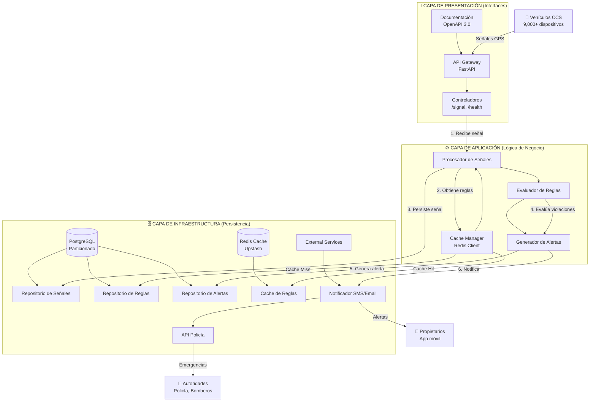
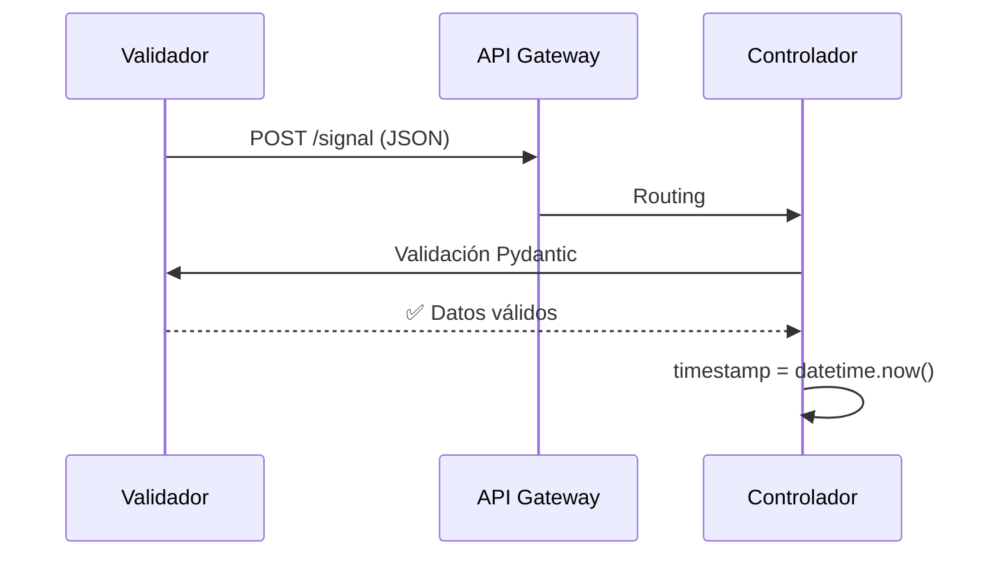
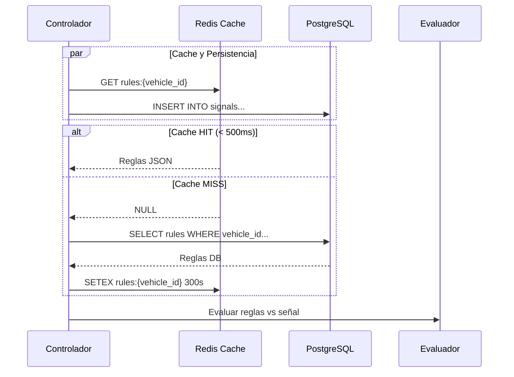
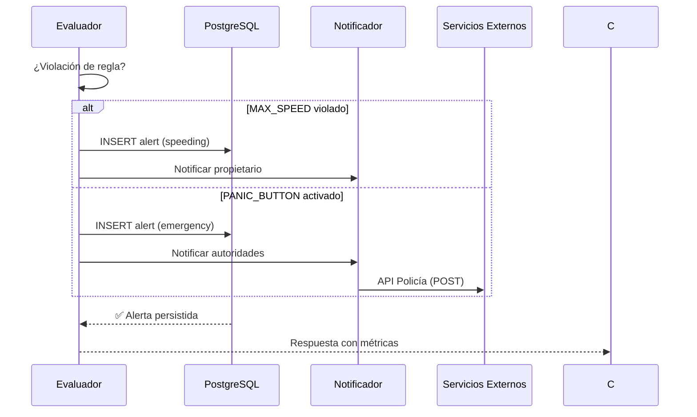

```
📁 docs/architecture/
└── 📄 COMPONENTS.md          # 📐 Diagrama de Componentes CCS
```

---

# 🏗️ COMPONENTES DE ARQUITECTURA - CCS CENTRAL

## 📊 **DIAGRAMA DE COMPONENTES**



---

## 🔧 **DESCRIPCIÓN DE COMPONENTES**

### **📱 CAPA DE PRESENTACIÓN**

| Componente | Tecnología | Responsabilidad |
|------------|------------|-----------------|
| **API Gateway** | FastAPI + Uvicorn | Punto único de entrada, routing, rate limiting |
| **Controladores** | FastAPI Endpoints | Validación entrada, orquestación flujo |
| **Documentación** | OpenAPI 3.0 + Swagger | Documentación automática, testing interactivo |

**Endpoints críticos:**
- `POST /signal` - Procesamiento principal de señales
- `GET /health` - Health check servicios
- `POST /update-rule` - Actualización reglas en caliente
- `GET /stats` - Métricas del sistema

### **⚙️ CAPA DE APLICACIÓN**

| Componente | Patrón | Responsabilidad |
|------------|--------|-----------------|
| **Procesador de Señales** | Command Handler | Orquestar flujo completo: validar → persistir → evaluar |
| **Evaluador de Reglas** | Business Rules Engine | Aplicar reglas de negocio (velocidad, pánico, geofence) |
| **Generador de Alertas** | Observer Pattern | Crear alertas basadas en violaciones, determinar acciones |
| **Cache Manager** | Cache-Aside Pattern | Gestionar cache Redis, invalidación, circuit breaker |

**Tipos de Reglas Implementadas:**
- `MAX_SPEED` - Exceso velocidad por vehículo
- `PANIC_BUTTON` - Botón de emergencia activado
- `UNSCHEDULED_STOP` - Detención no programada (futuro)
- `GEOFENCE_VIOLATION` - Salida zona autorizada (futuro)

### **🗄️ CAPA DE INFRAESTRUCTURA**

| Componente | Tecnología | Optimización |
|------------|------------|--------------|
| **PostgreSQL** | NeonDB (Serverless) | Tabla `signals` particionada por tiempo |
| **Redis Cache** | Upstash (Redis Cloud) | TTL 5 min, circuit breaker automático |
| **Repositorio Señales** | asyncpg + Connection Pool | Bulk inserts, 100 conexiones máx |
| **Repositorio Reglas** | Optimizado para cache | Índice `idx_rules_vehicle_active` |
| **Notificador** | Integración futura | Webhooks, SMS, Email, Push |

**Estrategia de Persistencia:**
```
Señal → PostgreSQL (tabla particionada signals)
       ↘ Evaluación → Si violación → PostgreSQL (tabla alerts)
                     ↘ Cache Redis (reglas activas)
```

---

## 🔄 **FLUJO DE UNA SEÑAL (SECUENCIA DETALLADA)**

### **1. Recepción y Validación**


### **2. Procesamiento Paralelo Optimizado**


### **3. Generación y Notificación de Alertas**


---

## ⚡ **OPTIMIZACIONES DE RENDIMIENTO**

### **Nivel de Base de Datos:**
| Técnica | Implementación | Impacto |
|---------|----------------|---------|
| **Particionamiento** | Tabla `signals` por mes | Reducción 10x en tiempo query |
| **Índices optimizados** | `(vehicle_id, timestamp DESC)` | Búsqueda señales recientes O(1) |
| **Connection Pool** | asyncpg pool (100 conexiones) | Soporta 500 RPS concurrentes |
| **Bulk Operations** | `executemany()` para alertas múltiples | Reduce I/O 90% |

### **Nivel de Cache:**
| Técnica | Implementación | Impacto |
|---------|----------------|---------|
| **Cache-Aside** | Redis + TTL 300s | Latencia: 500ms → 5ms |
| **Circuit Breaker** | Deshabilitar Redis si falla | Disponibilidad 99.9% |
| **Invalidación activa** | DELETE en `/update-rule` | Consistencia inmediata |
| **Serialización eficiente** | JSON (vs pickle) | Tamaño reducido 60% |

### **Nivel de Aplicación:**
| Técnica | Implementación | Impacto |
|---------|----------------|---------|
| **Async/Await** | FastAPI + asyncpg + redis.asyncio | Concurrencia masiva |
| **Timeouts agresivos** | Redis: 500ms, PG: 1500ms | Fallar rápido vs. violar SLA |
| **Logging estructurado** | Nivel WARNING en producción | Reducción I/O logs 80% |
| **Health checks ligeros** | Solo conexiones esenciales | Monitoreo sin overhead |

---

## 📈 **ESCALABILIDAD HORIZONTAL**

### **Escenario Actual (POC Validado):**
```
1 Instancia FastAPI → 500 RPS → PostgreSQL + Redis Cloud
```

### **Escenario de Producción (Recomendado):**
```
Load Balancer
    ├── Instancia API 1 (500 RPS)
    ├── Instancia API 2 (500 RPS)
    ├── Instancia API N (500 RPS)
    │
    ├── Redis Cluster (3 nodos)
    └── PostgreSQL Read Replicas (2)
        └── PostgreSQL Primary
```

### **Límites de Escala Identificados:**
| Componente | Límite Actual | Límite con Optimización |
|------------|---------------|-------------------------|
| **FastAPI** | ~500 RPS/instancia | ~2000 RPS con Gunicorn workers |
| **PostgreSQL** | ~1000 INSERTs/seg | ~5000 INSERTs/seg con batching |
| **Redis** | ~10,000 ops/seg | ~100,000 ops/seg con cluster |
| **Network** | Latencia 200-500ms (cloud) | <50ms (on-premise) |

---

## 🛡️ **PATRONES DE DISEÑO APLICADOS**

### **Patrones Estructurales:**
| Patrón | Aplicación | Beneficio |
|--------|------------|-----------|
| **Layered Architecture** | Presentación → Aplicación → Infraestructura | Separación responsabilidades |
| **Repository Pattern** | `VehicleRepository`, `AlertRepository` | Abstrac