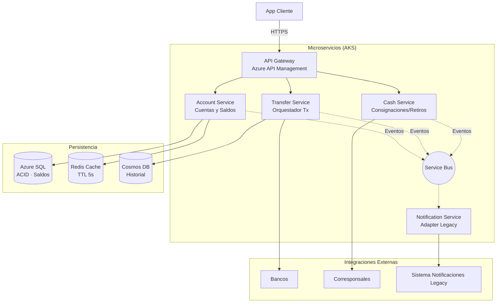

# 01 - Arquitectura de Alto Nivel 

**Contexto:** Billetera Digital de Alto Volumen (3.6M tx/día, SLO 99.95%)

---

## 1. Arquitectura Lógica

---

## 2. Componentes Clave

| Componente | Responsabilidad | Expuesto vía Gateway |
|------------|-----------------|---------------------|
| **API Gateway** | Auth, rate limiting, routing. Punto único de entrada. | Sí (público) |
| **Account Service** | Dueño del saldo. Consistencia fuerte (SQL). Lecturas desde Redis (CQRS, TTL 5s). | Sí (consultas) |
| **Transfer Service** | Orquesta transferencias internas (ACID) e interbancarias (Saga). | Sí (operaciones) |
| **Cash Service** | Consignaciones y retiros vía corresponsales. | Sí (operaciones) |
| **Notification Service** | Adaptador anticorrupción. Consume eventos → formato legacy. | No (interno) |

**Todo el tráfico cliente → API Gateway.** Los microservicios no tienen exposición pública.

---

## 3. Patrones Arquitectónicos

| Patrón | Dónde | Por qué |
|--------|-------|--------|
| **Microservicios** | División por dominio | Escala independiente: Cash (2M) vs Transfer (1.6M) vs Account |
| **CQRS** | Account Service | Lecturas (Redis TTL 5s), escrituras (SQL). Protege base transaccional. |
| **Saga Coreográfica** | Transferencia interbancaria | Bancos externos no soportan 2PC. Compensación local si falla. |
| **Outbox Pattern** | Publicación de eventos | Eventos en misma tx que operación. Garantiza entrega. |
| **Circuit Breaker** | Bank Adapters | Evita agotar hilos cuando banco externo falla. |
| **Cache-Aside** | Consultas de saldo | Redis first (TTL 5s). Fallback a SQL si cache miss. |

---

## 4. Consistencia

| Operación | Consistencia | Estrategia |
|-----------|--------------|------------|
| Débito/Crédito | **Fuerte** | ACID en SQL con pessimistic lock |
| Transferencia interna | **Fuerte** | ACID en SQL |
| Transferencia interbancaria | **Eventual con compensación** | Saga coreográfica |
| Consulta de saldo | **Eventual (2-5s)** | Redis cache TTL 5s |
| Historial | **Eventual** | Cosmos DB |

---

## 5. Trade-offs Clave

| Decisión | Ganamos | Sacrificamos |
|----------|---------|--------------|
| Microservicios | Escala independiente, aislamiento de fallos | Complejidad operativa |
| Saga coreográfica | No depende de 2PC con bancos externos | Consistencia eventual |
| CQRS + Redis TTL 5s | Lecturas rápidas, protege SQL | Consistencia eventual en saldos |
| Outbox Pattern | Garantía de entrega de eventos | Mayor espacio en BD |

---

**Documentos Relacionados:**
- [02-persistence-design.md](./02-persistence-design.md) → Modelo de datos, particionamiento
- [03-interbank-transfer-flow.md](./03-interbank-transfer-flow.md) → Flujo Saga detallado
- [04-tradeoffs-analysis.md](./04-tradeoffs-analysis.md) → ADRs completos
- [05-deployment-security-observability.md](./05-deployment-security-observability.md) → CI/CD, seguridad