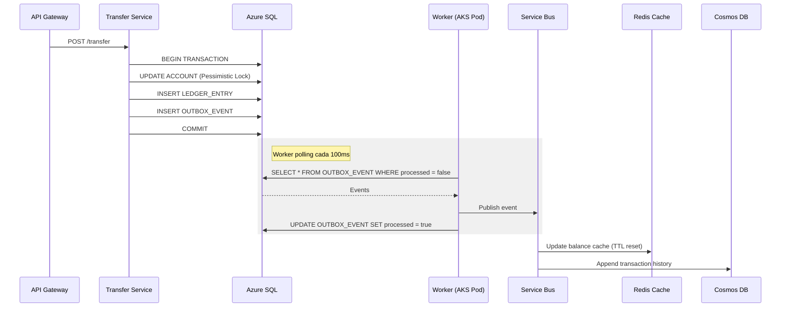

# 02 - Diseño de Persistencia 

**Contexto:** Billetera Digital de Alto Volumen (3.6M tx/día, SLO 99.95%)

---

## 1. Estrategia Multi-Base de Datos

| Almacén | Tecnología Azure | Responsabilidad Principal |
|---------|------------------|--------------------------|
| **Transaccional (Core)** | Azure SQL Database | Cuentas, retención de fondos, movimientos financieros ACID. |
| **Event Store** | Azure Cosmos DB | Historial transaccional, trazas de auditoría, append-only events. |
| **Caché en Memoria** | Azure Cache for Redis | Idempotencia, rate limiting, lecturas de saldo (Cache-Aside, TTL 5s). |

---

## 2. Modelo Relacional Core (Azure SQL)

Esquema normalizado para proteger la integridad financiera.

| Entidad | Campos Clave | Particionamiento |
|---------|--------------|------------------|
| **CLIENT** | PK, nombre, email, documento | Hash por client_id |
| **ACCOUNT** | PK, FK client, status, balance, reserved_balance, version | Hash por client_id |
| **LEDGER_ENTRY** | PK, FK account, transaction_id, amount, type, created_at | Range mensual por created_at |

**Estrategia de Particionamiento:**
- **ACCOUNT**: Hash partition por `client_id`. Distribución equitativa. Queries siempre por cliente.
- **LEDGER_ENTRY**: Range partition mensual por `created_at`. Facilita archivado, mejora queries recientes.

---

## 3. Historial y Eventos (Cosmos DB)

Las consultas masivas de historial **no tocan la base transaccional**. Se alimentan asíncronamente vía Service Bus.

| Container | Partition Key | Uso Principal | Retención |
|-----------|---------------|---------------|-----------|
| `TransactionHistory` | `/customerId` | Consultas de historial en la App | 365 días |
| `EventStore` | `/aggregateId` | Replay de eventos, compensaciones | 90 días |
| `AuditTrail` | `/resourceId` | Cumplimiento regulatorio | 7 años |

---

## 4. Estrategia de Caché (Redis)

Absorbe el **~90% del tráfico de lectura**, protegiendo Azure SQL.

| Patrón de Llave | Tipo | TTL | Propósito |
|-----------------|------|-----|-----------|
| `balance:{accountId}` | String | 5 seg | Saldo disponible (cache-aside) |
| `idempotency:{key}` | String | 24 hrs | Previene duplicados por reintentos |
| `rate-limit:{customerId}` | Integer | 60 seg | Bloquea abuso de endpoints |
| `pending:{transferId}` | Hash | 300 seg | Estado de transferencia en curso |

---

## 5. Matriz de Consistencia

| Operación | Consistencia | Estrategia |
|-----------|--------------|------------|
| **Actualización de Saldo** | Fuerte | Transacción SQL con pessimistic lock |
| **Transferencia Interna** | Fuerte | Transacción ACID origen y destino |
| **Transferencia Interbancaria** | Eventual | Saga coreográfica. Reserva fuerte, confirmación eventual. |
| **Consulta de Saldo** | Eventual (< 5s) | Lectura Redis TTL 5s. Actualización asíncrona post-escritura. |
| **Consulta de Movimientos** | Eventual | Eventos SQL → Cosmos DB vía Service Bus. |

---

## 6. Patrones de Datos Aplicados

| Patrón | Implementación | Propósito |
|--------|----------------|-----------|
| **CQRS** | Write: SQL / Read: Redis + Cosmos | Escrituras a SQL. Lecturas desde caché e historial. |
| **Outbox Pattern** | Tabla `OutboxEvents` en SQL + Worker polling | Eventos en misma transacción ACID. Worker garantiza entrega. |
| **Pessimistic Locking** | `SELECT ... FOR UPDATE` | Débitos/créditos. Garantiza exclusividad hasta commit. |
| **Optimistic Concurrency** | Campo `version` en `ACCOUNT` | Prevención de sobreescrituras concurrentes. |
| **Cache-Aside** | Redis first, SQL fallback | Consultas de saldo no golpean SQL si está cacheado. |

---

## 7. Flujo de Escritura y Replicación (Outbox Pattern)

**Mecanismo:** Worker polling en AKS (mismo clúster). Procesamiento por lotes cada 100ms. Garantía *at-least-once*.

---

## 8. Resiliencia y Recuperación (RPO/RTO)

| Componente | Estrategia | RPO | RTO |
|------------|------------|-----|-----|
| **Azure SQL** | Geo-replication activa + PITR backups | < 5 min | < 15 min |
| **Cosmos DB** | Continuous backup (geo-redundant) | < 1 min | < 5 min |
| **Redis Cache** | Caché volátil. Fuente de verdad en SQL. | Pérdida asumible | Automático (failover) |

**Plan de Recuperación ante fallo de SQL Primary:**
1. Failover automático a réplica secundaria (< 30s)
2. Si falla, restaurar backup PITR
3. Replay de eventos desde Cosmos DB para recuperar transacciones en tránsito
4. Reconstrucción de caché Redis desde SQL restaurado

---

## 9. Resumen de Decisiones

| Decisión | Alternativa Rechazada | Justificación |
|----------|----------------------|---------------|
| **Multi-db (SQL + Cosmos + Redis)** | Single database | Cada workload en motor óptimo. Costo/performance balanceado. |
| **Pessimistic locking** | Optimistic locking solo | Riesgo de condición de carrera no aceptable en finanzas. |
| **Outbox Pattern + Worker polling** | Publicación directa al Bus | Garantiza entrega ante fallos del broker. |
| **Redis TTL 5 seg** | TTL más largo | Balance entre rendimiento API y precisión del saldo visible. |
| **Hash partition por client_id** | Partition por fecha | Queries siempre filtran por cliente. Distribución equitativa. |
| **Worker polling (AKS)** | Azure Function | Mantiene simplicidad de infraestructura dentro del clúster. |

---

**Documentos Relacionados:**
- [01-architecture-high-level.md](./01-architecture-high-level.md) → omponentes, patrones, TTL alineado (5s)
- [03-interbank-transfer-flow.md](./03-interbank-transfer-flow.md) → Flujo Saga detallado
- [04-tradeoffs-analysis.md](./04-tradeoffs-analysis.md) → ADRs completos
- [05-deployment-security-observability.md](./05-deployment-security-observability.md) → CI/CD, seguridad