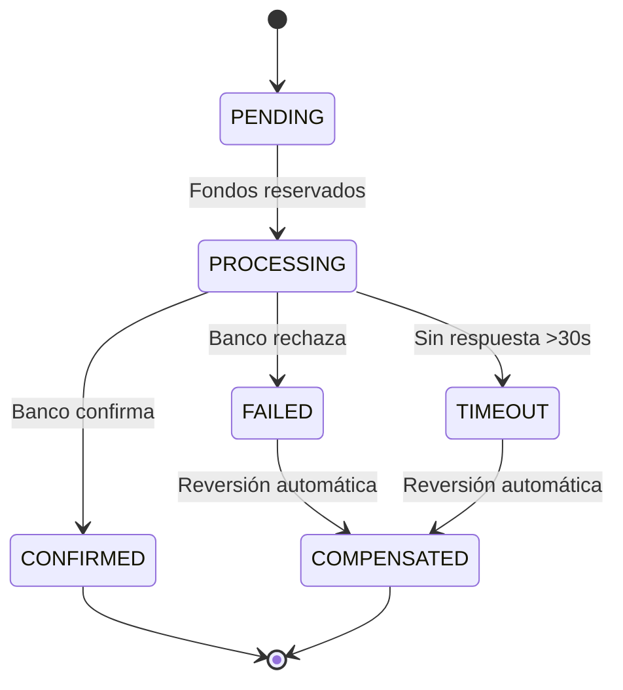
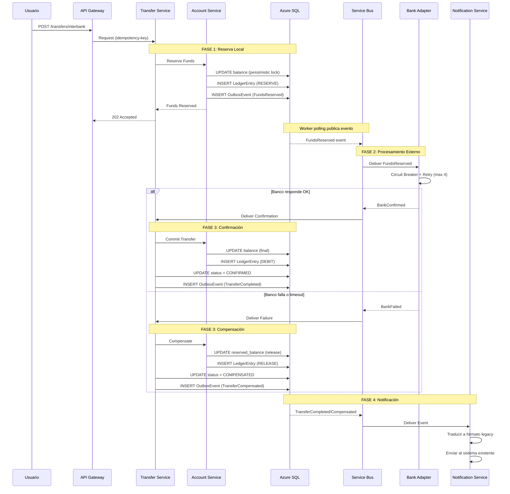

# 03 - Transferencia Interbancaria 

**Contexto:** Transferencias entre billetera digital y bancos externos. Volumen: 600K tx/día. Requiere manejo de estados, compensación y resiliencia.

---

## 1. Estados de la Transferencia

| Estado | Responsable | Descripción |
|--------|-------------|-------------|
| **PENDING** | Transfer Service | Solicitud recibida, validación inicial. |
| **PROCESSING** | Transfer Service | Fondos reservados en cuenta origen, esperando banco externo. |
| **CONFIRMED** | Transfer Service | Banco confirmó, transferencia completada. |
| **FAILED** | Bank Adapter | Banco rechazó operación (ej. cuenta inválida). |
| **TIMEOUT** | Bank Adapter | Banco no respondió en ventana de tiempo (30s). |
| **COMPENSATED** | Transfer Service | Fondos reversados y liberados al usuario. |

---

## 2. Flujo Completo (Saga Coreográfica)

---

## 3. Resiliencia

| Mecanismo | Configuración | Propósito |
|-----------|---------------|-----------|
| **Circuit Breaker** | 5 fallos en 30s → OPEN 60s → HALF-OPEN → CLOSED | Evita agotar recursos cuando banco externo falla. |
| **Retry** | Exponential backoff: 1s, 2s, 4s, 8s (máx 4 intentos) | Maneja fallos transitorios sin sobrecargar. |
| **Timeout** | 30 segundos por llamada | Balance entre dar tiempo al banco y UX aceptable. |
| **Dead-letter** | 4 intentos fallidos → cola manual | Casos excepcionales requieren intervención de soporte N2. |

**Compensación:** Automática en todos los casos de fallo. Solo dead-letter requiere revisión manual.

---

## 4. Eventos de la Saga

| Evento | Publicado por | Consumido por | Acción |
|--------|---------------|---------------|--------|
| `FundsReserved` | Account Service | Bank Adapter | Inicia llamada al banco. |
| `BankConfirmed` | Bank Adapter | Transfer Service | Confirma y consolida saldo. |
| `BankFailed` | Bank Adapter | Transfer Service | Compensa y libera fondos. |
| `TransferCompleted` | Transfer Service | Notification Service | Notifica éxito. |
| `TransferCompensated` | Transfer Service | Notification Service | Notifica reversión. |

---

## 5. Idempotencia

| Mecanismo | Propósito |
|-----------|-----------|
| **Idempotency Key** (cliente) + Redis (TTL 24h) | Previene duplicados por reintentos de red en dispositivos móviles. |
| **Unique Key** (transfer_id) en SQL | Garantiza que una misma transferencia no se procese dos veces. |

---

## 6. Matriz de Consistencia por Fase

| Fase | Operación | Consistencia | Estrategia |
|------|-----------|--------------|------------|
| **Fase 1** | Reserva de fondos | **Fuerte** | ACID en SQL con pessimistic lock. |
| **Fase 2** | Llamada a banco | **Eventual** | Saga asíncrona. No hay 2PC. |
| **Fase 3** | Confirmación/Compensación | **Fuerte** | ACID en SQL. |
| **Fase 4** | Notificación | **Eventual** | Outbox + Service Bus garantiza entrega. |

---

## 7. Escalamiento

| Componente | Capacidad | Estrategia |
|------------|-----------|------------|
| **Transfer Service** | 600K tx/día | HPA en AKS (CPU > 70%) |
| **Bank Adapters** | Por banco | Pool de conexiones aislado por adapter |
| **Service Bus** | 600K eventos/día | Premium Tier, particiones por banco |

---

## 8. Resumen de Decisiones

| Decisión | Alternativa Rechazada | Justificación |
|----------|----------------------|---------------|
| **Saga coreográfica** | Saga orquestada | Menor acoplamiento. Escala natural con Service Bus. |
| **Circuit Breaker** | Retry infinito | Evita agotar hilos AKS cuando banco externo falla. |
| **Timeout 30s** | Timeout > 60s | Balance entre dar tiempo al banco y UX aceptable. |
| **Compensación automática** | Revisión manual masiva | Recuperación inmediata de saldos. Sin saturar soporte. |
| **Dead-letter manual** | Reintento infinito | Casos excepcionales requieren análisis humano. |

---

**Documentos Relacionados:**
- [01-architecture-high-level.md](./01-architecture-high-level.md) → omponentes, patrones, TTL alineado (5s)
- [02-persistence-design.md](./02-persistence-design.md) → Modelo de datos, particionamiento
- [04-tradeoffs-analysis.md](./04-tradeoffs-analysis.md) → ADRs completos
- [05-deployment-security-observability.md](./05-deployment-security-observability.md) → CI/CD, seguridad