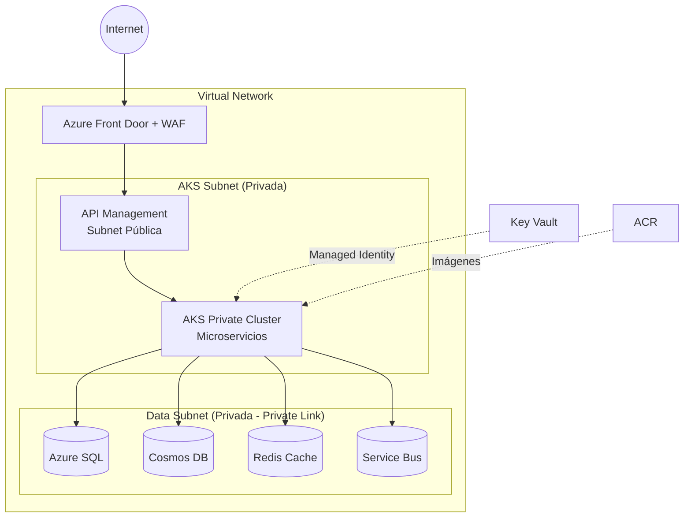

# 05 - Despliegue, Seguridad y Observabilidad d

**Contexto:** Billetera Digital de Alto Volumen (3.6M tx/día, SLO 99.95%)

---

## 1. Topología de Red (Azure)

**Zero Trust:** Todo tráfico interno via Private Link. Sin IPs públicas en datos.

---

## 2. Seguridad por Capas

| Capa | Estrategia |
|------|------------|
| **Perímetro** | Azure Front Door + WAF (DDoS, OWASP Top 10, geo-filtrado) |
| **Gateway** | API Management (rate limiting, JWT vía Entra ID) |
| **Aplicación** | AKS Private Cluster, Pod Security Policies |
| **Datos** | Private Link. Encryption at rest por defecto. |
| **Secretos** | Azure Key Vault + Managed Identity |
| **Identidad** | Entra ID para autenticación. Managed Identity para servicios |

**Datos sensibles** (detalle en 02-persistence-design.md):
- Documento de identidad, cuenta bancaria: Always Encrypted en SQL
- Correo electrónico: enmascaramiento dinámico
- Auditoría completa con retención 7 años

---

## 3. CI/CD (Azure DevOps)

| Entorno | Estrategia | Justificación |
|---------|------------|---------------|
| **Integración** | Tests unitarios + SonarQube + escaneo ACR | Calidad antes de desplegar |
| **QA/Staging** | Despliegue semanal + pruebas de carga (120% pico) | Validación no funcional |
| **Producción** | Rolling update (maxSurge 25%, maxUnavailable 0) + health probes | Cero downtime |
| **Rollback** | `kubectl rollout undo` o revertir tag | Recuperación < 30s |
| **Hotfix** | Branch desde tag producción + versión patch | Críticos con prioridad |

---

## 4. Observabilidad

| Propósito | Herramienta | Implementación Clave |
|-----------|-------------|----------------------|
| **Tracing distribuido** | Application Insights | `X-Correlation-ID` para trazar desde Gateway → Servicios → Bus → Adapters |
| **Métricas** | Azure Monitor | CPU/Memoria AKS, DTU SQL, RU Cosmos, Queue length Service Bus |
| **Logs** | Log Analytics | Logs estructurados JSON, consultas KQL |
| **Alertas** | Azure Alerts + PagerDuty/Slack | Alertas críticas (ver tabla) |

**Métricas clave monitoreadas:**
- Business: Tx/día, valor movido, top bancos
- Aplicación: Latencia p95, error rate, throughput
- Infraestructura: AKS, SQL, Cosmos, Service Bus

| Alerta | Condición | Acción |
|--------|-----------|--------|
| Latencia p99 > 2s | 3 veces/5min | Escalar pods, alertar SRE |
| Error rate > 1% | 5 min consecutivos | Circuit Breaker, on-call |
| Dead-letter queue > 0 | Inmediato | Worker caído, revisión manual |
| Circuit Breaker OPEN | Inmediato | Alertar equipo integraciones |

---

## 5. Escalamiento y Disponibilidad (SLO 99.95%)

| Nivel | Mecanismo | Configuración |
|-------|-----------|---------------|
| **Pods** | HPA | Escala por CPU (>70%) o memory (>80%) |
| **Nodos** | Cluster Autoscaler | Min 3, Max 20 nodos. Distribuidos en 3 Availability Zones |
| **Bases de Datos** | Auto-scaling / Serverless | Ver RPO/RTO en documento 02 |
| **Service Bus** | Premium Tier | Particionado por banco |

**Escalamiento por servicio:**

| Servicio | Min Pods | Max Pods | Métrica | Umbral |
|----------|----------|----------|---------|--------|
| Account Service | 3 | 20 | CPU | 70% |
| Transfer Service | 3 | 15 | CPU | 65% |
| Cash Service | 5 | 30 | CPU + Memory | 70% |
| Notification Service | 2 | 10 | Service Bus queue length | 100 msgs/pod |

---

## 6. Resiliencia (RPO/RTO)

| Componente | Estrategia | RPO | RTO |
|------------|------------|-----|-----|
| **Azure Front Door** | Multi-region routing | 0 | Automático (< 2 min) |
| **AKS + ACR** | Infraestructura como código (Terraform) + ACR geo-replicado | N/A (efímero) | < 30 min |
| **Bases de Datos** | Geo-replication + backups | Ver documento 02 | Ver documento 02 |

**Plan de recuperación regional:**
1. Front Door conmuta a región secundaria (health probe < 30s)
2. AKS despliegue desde ACR geo-replicado (Terraform apply)
3. Bases de datos: failover automático (ver 02-persistence-design.md)

---

## 7. Resumen de Decisiones

| Decisión | Alternativa Rechazada | Justificación | Trade-off |
|----------|----------------------|---------------|-----------|
| **Azure Front Door + WAF** | Solo APIM | Protección DDoS, WAF OWASP, balanceo global | Costo adicional |
| **Private Links** | IPs públicas con firewall | Máximo aislamiento. Sin exposición a internet | Costo por Private Link |
| **Managed Identities** | Connection strings en código | Eliminación de credenciales estáticas | Curva aprendizaje |
| **Rolling Update** | Blue-Green | Simplicidad operativa. Cero downtime | Reversión ligeramente más lenta |
| **Application Insights** | Prometheus + Grafana | Traza distribuida automática. Integración nativa | Vendor lock-in Azure |
| **Availability Zones** | Single zone | Resiliencia ante fallos de datacenter | Mayor latencia intra-región |
| **AKS Private Cluster** | Cluster público | Seguridad por defecto | Complejidad networking |

---

**Documentos Relacionados:**
- `01-architecture-high-level.md` → Componentes y patrones
- `02-persistence-design.md` → RPO/RTO bases de datos, datos sensibles
- `03-interbank-transfer-flow.md` → Circuit Breaker, retries, dead-letter
- `04-tradeoffs-analysis.md` → ADRs completos