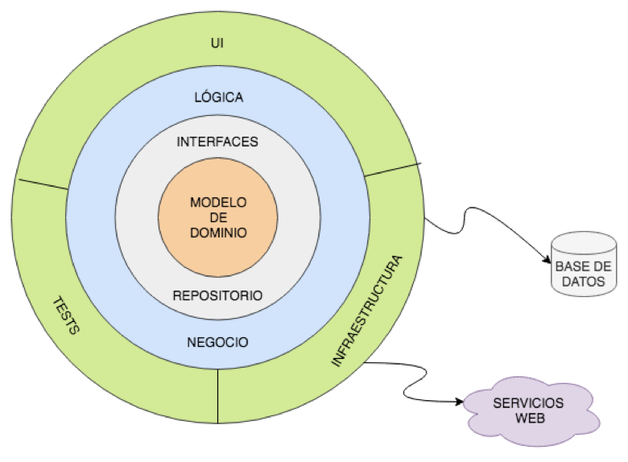
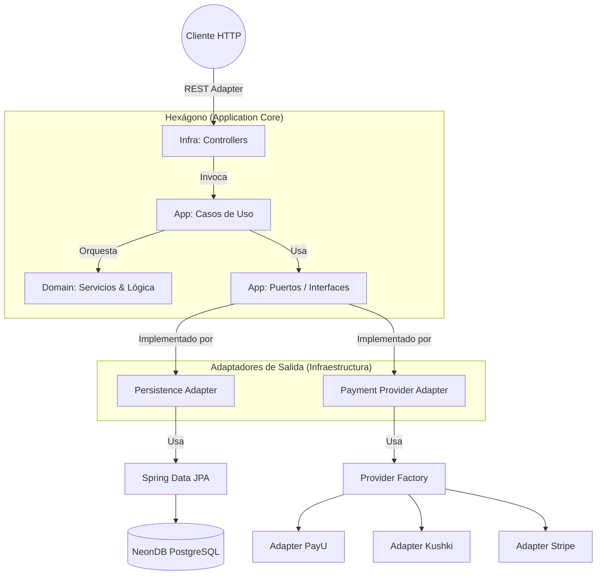
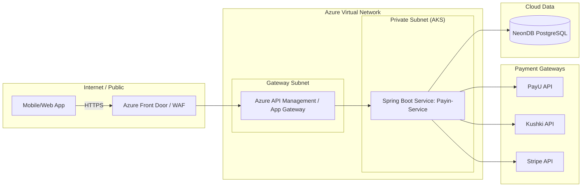
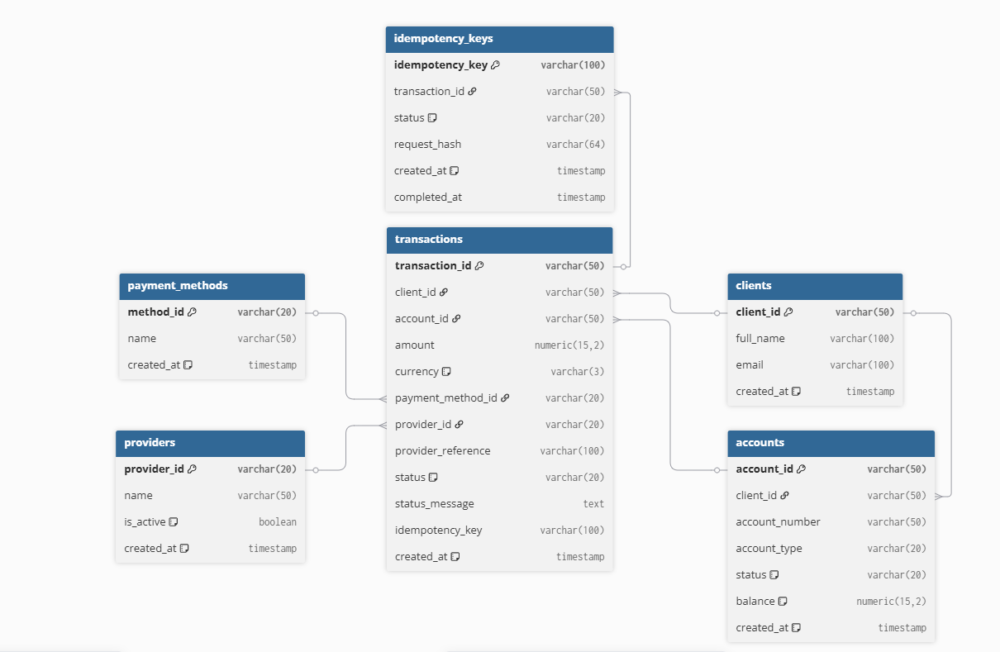

# TumiPay - PayIn Service Component

Componente de dominio transaccional diseñado para gestionar el ciclo de vida de operaciones de ingreso de dinero (**PayIns**). Este microservicio implementa una **Arquitectura Hexagonal (Ports and Adapters)** estricta, asegurando un desacoplamiento total entre las reglas de negocio y los detalles de infraestructura.

---

## 🏗️ Arquitectura y Diseño

El sistema se basa en los principios de **Clean Architecture** y **Domain-Driven Design (DDD)**, donde el núcleo (Dominio) es independiente de frameworks externos, bases de datos o servicios de terceros.

### Diagrama de Arquitectura (Visual)




### Diagrama de Componentes (Lógica Hexagonal)


### Diagrama de Arquitectura de Infraestructura (Propuesta Productiva en Azure)



---

## 📁 Estructura del Proyecto

La organización sigue el estándar hexagonal para asegurar que las dependencias fluyan exclusivamente hacia el centro (Dominio).

```text
src/main/java/com/tumi/payln/
├── domain/                      # Núcleo puro (POJOs)
│   ├── model/                   # Entidades y Value Objects (Amount, PaylnStatus)
│   ├── repository/              # Interfaces de repositorio de dominio
│   └── service/                 # Lógica pura (PaylnValidator, PaylnStateMachine)
├── application/                 # Capa de aplicación (orquestación)
│   ├── dto/                     # DTOs de entrada y salida
│   ├── port/                    # Puertos de salida (interfaces)
│   └── service/                 # Casos de uso
├── infrastructure/              # Capa de infraestructura
│   ├── adapter/                 # Implementaciones técnicas de los puertos
│   │   ├── persistence/         # Adaptadores JPA
│   │   ├── provider/            # Adaptadores de pasarelas (PayU, Kushki, Stripe)
│   │   ├── rest/                # Controladores REST
│   │   └── factory/             # Factoría de proveedores
│   ├── config/                  # Configuración de beans
│   ├── persistence/             # Entidades JPA y repositorios Spring Data
│   └── exception/               # Manejo global de errores
└── PayinServiceApplication.java # Entry point
```

---

## 📊 Modelo de Datos (DER)

El diseño de base de datos está optimizado para garantizar **integridad transaccional** e **idempotencia**.



---

## 🧠 Decisiones Arquitectónicas (Technical Rationale)

* **Inversión de Dependencias (DIP):** El dominio no depende de Spring. Los servicios de dominio se registran mediante configuración, manteniendo el núcleo agnóstico al framework.
* **Idempotencia fuerte:** Tabla dedicada `idempotency_keys` para evitar doble procesamiento ante reintentos.
* **Máquina de estados de dominio:** Las transiciones viven en `PaylnTransaction`; no se puede llegar a `PROCESSED` sin pasar por `VALIDATED`.
* **Validación de reglas de negocio:** `PaylnValidator` valida estado de cuenta y disponibilidad del proveedor antes de permitir el pago.

---

## 🎨 Patrones de Diseño Aplicados

Para que el código sea fácil de mantener y escalar, aplicamos estos patrones:

### Adapter Pattern

* **Propósito:** Permitir que piezas que hablan "idiomas" diferentes se entiendan sin mezclarse.
* **Aplicación:** Lo usamos para conectar nuestro código de negocio con herramientas externas. Tenemos adaptadores para la base de datos (JPA) y adaptadores para cada banco o pasarela (PayU, Kushki, Stripe). Si mañana cambiamos de banco, solo cambiamos el adaptador y el resto del sistema sigue igual.

### Strategy Pattern

* **Propósito:** Tener varias formas de hacer una tarea y poder elegir la mejor en el momento.
* **Aplicación:** `IPaymentProviderPort` Define el proceso de pago. El sistema tiene diferentes "estrategias" (una por cada banco). Esto permite que el proceso principal sea el mismo, sin importar si el dinero se mueve por una pasarela u otra.

### Factory Pattern

* **Propósito:** Centralizar la creación de objetos para que el resto del código no tenga que saber "cómo" se fabrican.
* **Aplicación:** `PaymentProviderFactory` Tenemos una clase que funciona como una oficina de despacho. Cuando llega una petición, esta "fábrica" revisa el nombre del proveedor solicitado y nos entrega automáticamente el adaptador de pago correcto para trabajar.

### Builder Pattern

* **Propósito:** Separar construcción de representación.
* **Aplicación:** `PaylnTransaction` Lo usamos para crear transacciones. Es vital porque nos permite dos cosas: crear una transacción nueva desde cero con valores iniciales, o reconstruir una vieja que traemos de la base de datos respetando su estado original sin dañarla.

### Repository Pattern

* **Propósito:** Abstraer el acceso a datos.
* **Aplicación:** Puertos de dominio con implementación Spring Data JPA.

---

## 🚀 Pruebas y Ejecución

### Requisitos

* Java 17+
* Maven 3.8+
* Conexión a NeonDB (PostgreSQL)

### Comandos

```bash
mvn clean compile
mvn spring-boot:run
```

### Endpoints de Prueba

**A. Obtener clientes**

```bash
curl http://localhost:8080/api/v1/clients
```

**B. Procesar un PayIn**

```bash
curl -X POST http://localhost:8080/api/v1/payins \
     -H "Content-Type: application/json" \
     -H "x-idempotency-key: {{UNIQUE_KEY}}" \
     -d '{
        "client_id": "cli-123-test",
        "account_id": "acc-active-001",
        "amount": 50000,
        "payment_method_id": "pse",
        "provider_id": "payu"
     }'
```

---

## 📋 Suposiciones y Riesgos

* **Suposición:** La autenticación se delega a un API Gateway (Zero Trust).
* **Riesgo:** Falla posterior al cargo puede dejar la transacción en `VALIDATED`.
* **Mitigación:** Soporte para conciliación asíncrona (batch).
