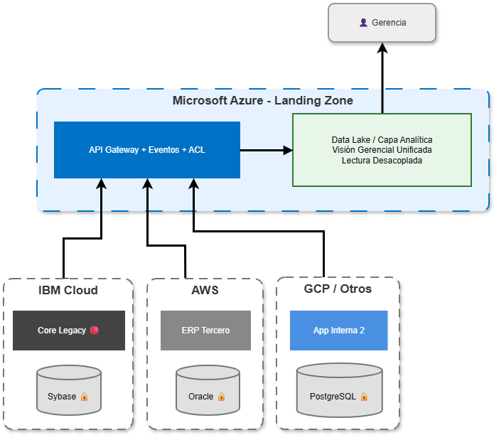
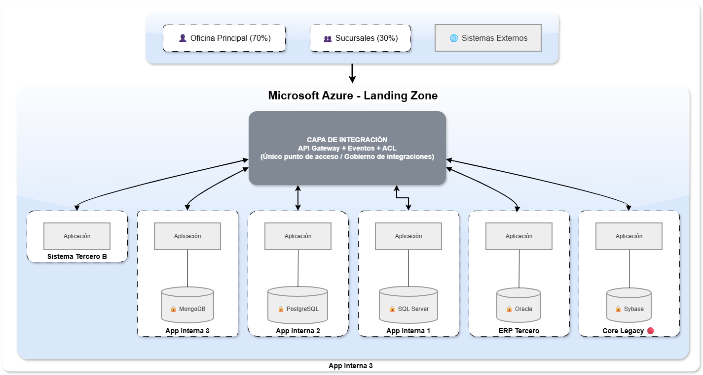
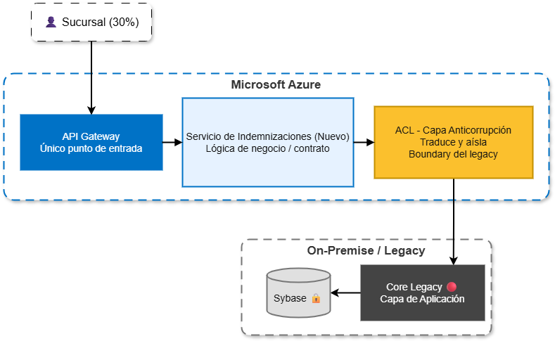
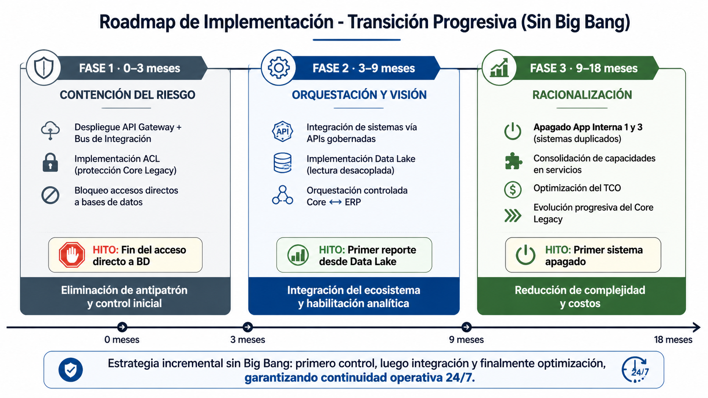

# Propuesta de Solución de Arquitectura (EL CÓMO)

## Propósito
Definir la estrategia para transformar el ecosistema actual, eliminando silos y antipatrones de integración, garantizando continuidad operativa (24/7) y habilitando la evolución progresiva del negocio.

---

## 0. Resumen Ejecutivo
Centralizaremos el control del ecosistema en una Landing Zone (Azure como plataforma principal), reduciendo la fragmentación multicloud. Implementaremos una capa de integración que aislará completamente el acceso a las bases de datos, eliminando accesos directos desde sucursales y sistemas externos. De forma progresiva, racionalizaremos aplicaciones duplicadas y habilitaremos una visión unificada de datos, reduciendo el TCO (costo total de propiedad) y mejorando la continuidad operativa.

---

## 1. Lineamientos Base

| Principios de Arquitectura | Gobierno de Arquitectura |
|---------------------------|--------------------------|
| • No interrupción de la operación (24/7) | • Comité de Arquitectura como autoridad transversal |
| • Evolución progresiva (sin Big Bang) | • Validaciones automáticas en CI/CD |
| • Desacoplamiento entre sistemas | • Prevención de integraciones no autorizadas |
| • Prohibición de acceso directo a datos fuera del dominio | • Todo consumo de datos vía capa de integración |
| • Integración gobernada (no punto a punto) | |

---

## 2. Arquitectura Objetivo (To-Be)

### 2.1 Topología Cloud
**Hecho problema:** Operación fragmentada en múltiples nubes sin control ni integración  
**Decisión:** Establecer Azure como Landing Zone principal y contener el crecimiento en nubes secundarias  
**Resultado:** Ecosistema controlado y reducción de complejidad operativa  

**Anexo A3 – Topología Cloud y Datos Objetivo**  

---

### 2.2 Integración (Capa central)
**Hecho problema:** Integraciones espagueti y accesos directos a bases de datos  
**Decisión:** Implementar API Gateway + Eventos + ACL (capa anticorrupción) como único punto de comunicación  
**Resultado:** Cero accesos directos a datos y protección del Core Legacy  

**Anexo A1 – Arquitectura Objetivo**  

**Anexo A2 – Flujo de Integración (Protección)**  

---

### 2.3 Datos (Visión unificada)
**Hecho problema:** Datos fragmentados y sin visión consolidada  
**Decisión:** Implementar Data Lake desacoplado (lectura separada de operación)  
**Resultado:** Visión gerencial unificada sin afectar sistemas transaccionales  

Referencia visual en Anexo A3.

---

### 2.4 Aplicaciones (Racionalización)
**Hecho problema:** Duplicidad en procesos críticos (Indemnizaciones / Suscripción)  
**Decisión:** Encapsular el Core y eliminar sistemas redundantes  
**Resultado:** Reducción del portafolio y simplificación operativa  

**Anexo A4 – Racionalización de Aplicaciones**

| Sistema Actual (As-Is) | Proceso Clave | Decisión de Arquitectura | Estado |
|-----------------------|--------------|--------------------------|--------|
| Core Legacy (IBM) | Indemnizaciones / Suscripción | Encapsular vía ACL (capa anticorrupción) + APIs | 🟡 TRANSICIÓN |
| ERP Tercero (AWS) | Facturación | Integrar vía API Gateway / Bus | 🟢 MANTENER |
| ~~App Interna 1~~ | Indemnizaciones (Duplicado) | Retirar | 🔴 RETIRAR |
| App Interna 2 (GCP) | Talento Humano | Integrar al Bus | 🟢 MANTENER |
| ~~App Interna 3~~ | Suscripción (Duplicado) | Retirar | 🔴 RETIRAR |
| Sistema Tercero B | CRM | Integrar al Bus | 🟢 MANTENER |

---

## 3. Estrategia de Transición
**Anexo A5 – Roadmap de Implementación**  

---

## 4. Impacto

| Operativo                              | Técnico                              | Negocio                                   |
|----------------------------------------|--------------------------------------|--------------------------------------------|
| Continuidad garantizada 24/7           | Eliminación de antipatrones          | Reducción del TCO (costo total de propiedad) |
| Reducción de fallas en cascada         | Control total sobre integraciones    | Información unificada para decisiones      |

---

## 5. Riesgos y Mitigación

| Riesgo | Impacto | Mitigación |
|--------|--------|-----------|
| Latencia en integraciones | Alto | Pruebas de carga |
| Resistencia al cambio | Medio | Capacitación |
| Dependencia del legacy | Alto | Uso de ACL (capa anticorrupción) |

---

## 6. Conclusión

La solución no reemplaza el ecosistema actual, lo controla.  
Se gobiernan las integraciones, se protege el acceso a datos y se habilita una evolución progresiva sin interrumpir la operación.

**Resultado final:** control → integración → optimización.