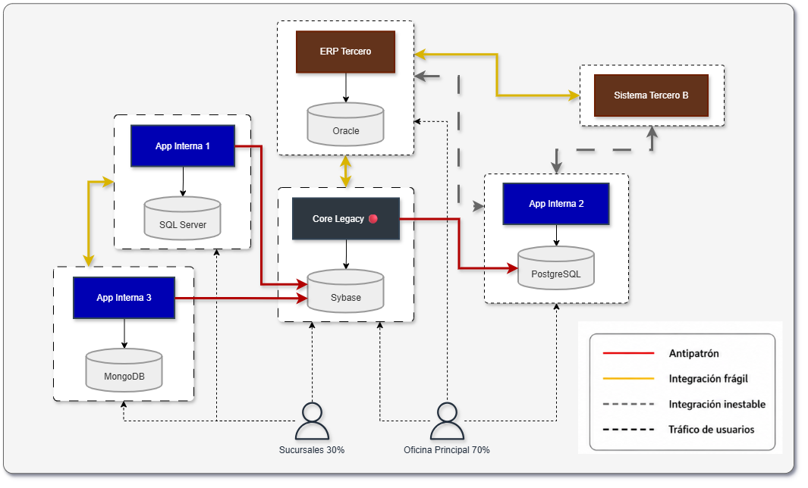
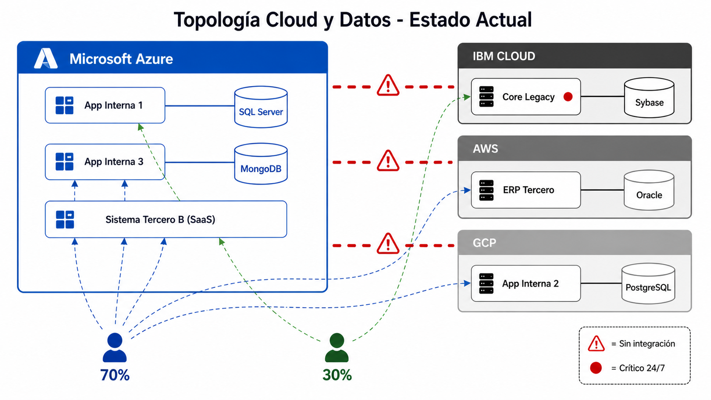

# Diagnóstico de Arquitectura (EL QUÉ)

## Propósito
Alinear el contexto actual de la compañía, identificar el problema estructural del ecosistema de aplicaciones y establecer las restricciones bajo las cuales debe plantearse una solución, sin proponerla aún.

---

## 0. Resumen Ejecutivo
Seguros del Estado enfrenta un desafío crítico de fragmentación tecnológica en su ecosistema de más de 30 aplicaciones. La ausencia de un gobierno de arquitectura centralizado ha generado duplicidad funcional, altos costos operativos y riesgos de continuidad. El objetivo es evolucionar hacia un modelo integrado y estandarizado que unifique la visión de los datos y simplifique la operación multicloud (Azure, AWS, GCP, IBM), sin interrumpir la operación 24/7 que soporta procesos críticos como Indemnizaciones, Suscripción y Talento Humano.

---

## 1. Enfoque del Problema
**Tipo de reto:**  
Arquitectura empresarial y modernización de ecosistema existente (brownfield), no un desarrollo desde cero (Greenfield).

**Límites críticos (restricciones operativas/financieras):**  
- Garantizar la continuidad de la operación sin interrupciones en sistemas críticos (Zero-Downtime).  
- Convivencia con tecnologías heterogéneas (internas y de terceros).  
- Optimización de costos de mantenimiento en un entorno multicloud.

---

## 2. Contexto General
**Portafolio actual:** Ecosistema compuesto por más de 30 aplicaciones con distintos niveles de madurez, desarrolladas por fábrica interna y terceros.

**Procesos de negocio críticos:** Indemnizaciones, talento humano, suscripción, pólizas, facturación, entre otros.

**Distribución de uso y actores impactados:**
- 70% de la carga operativa en la oficina principal y 30% en sucursales.  
- Impacta directamente a áreas operativas, empleados y clientes finales.

**Gobierno y madurez:** Baja estandarización arquitectónica, ausencia de gobierno centralizado y evolución tecnológica desalineada entre aplicaciones.

### Mapa de Capacidades vs Aplicaciones (Estado Actual)
El siguiente mapa cruza los procesos críticos con los sistemas que los soportan, evidenciando la redundancia funcional en la operación[cite: 3].

| Capacidades de Negocio | Core Legacy 🔴 (24/7) | ERP Tercero | App Interna 1 | App Interna 2 | App Interna 3 | Sistema Tercero B | Total |
|------------------------|-----------------------|-------------|---------------|---------------|---------------|-------------------|-------|
| Indemnizaciones        | 🟥 X                  | 🟥 X        | 🟥 X          |               |               |                   | 3     |
| Suscripción            | 🟥 X                  |             | 🟥 X          |               | 🟥 X          |                   | 3     |
| Talento Humano         |                       | 🟨 X        |               | 🟨 X          |               |                   | 2     |
| Emisión de Pólizas     | 🟩 X                  |             |               |               |               |                   | 1     |
| Facturación            |                       | 🟨 X        | 🟨 X          |               |               |                   | 2     |
| CRM / Atención         |                       |             |               |               | 🟨 X          | 🟨 X              | 2     |

> 📌 **Nota:** El 30% del uso operativo corresponde a **sucursales**, distribuidas en los sistemas: Core Legacy, App Interna 1 y App Interna 3[cite: 3].

**Leyenda:** 🔴 Sistema crítico 24/7 | 🟥 Alta duplicidad en procesos core | 🟨 Riesgo medio | 🟩 Estable[cite: 3].

---

## 3. Problema Estructural (Causa raíz)
La ausencia de un gobierno de arquitectura empresarial y de una estrategia de interoperabilidad estandarizada ha permitido un crecimiento orgánico en silos tecnológicos. Cada sistema opera con su propia lógica de datos y tecnología, lo que impide una visión consolidada del negocio y limita la capacidad de evolución del ecosistema.

### Mapa de Integraciones (Espagueti)
Este diagrama ilustra los antipatrones de diseño actuales, destacando las conexiones directas no gobernadas hacia bases de datos críticas[cite: 3].

---

## 4. Síntomas y Riesgos
**Consecuencias observables (dolor actual):**  
- Duplicidad de funcionalidades entre sistemas.
- Altos costos de operación y mantenimiento.  
- Integraciones punto a punto complejas o inexistentes.  
- Dificultad para obtener reportes unificados.  
- Obsolescencia tecnológica. 
- Bajo nivel de monitoreo y control.

**Riesgos inminentes (qué pasa si no se actúa):**  
- **Continuidad:** fallas en integraciones pueden generar caídas en procesos críticos.  
- **Seguridad:** vulnerabilidades por falta de estándares en el manejo de datos.  
- **Financiero:** incremento del costo total de propiedad por mantenimiento de múltiples plataformas y tecnologías.  

### Inventario Estratégico de Aplicaciones
El inventario detalla el estado, obsolescencia y nivel de riesgo de los sistemas que soportan la operación actual[cite: 3].

| Sistema | Proceso Core | Criticidad | Nube | Base de Datos | Origen | Antigüedad | Estado | Alcance |
|---------|--------------|------------|------|---------------|--------|------------|--------|---------|
| **Core Legacy** | Indemnizaciones | 🔴 Alta (24/7) | IBM | Sybase | Interno | 15 años | ⚪ | Principal + Sucursales |
| **ERP Tercero** | Facturación | 🔴 Alta (24/7) | AWS | Oracle | Tercero | 12 años | 🔴 | Principal |
| **App Interna 1** | Indemnizaciones | 🔴 Alta | Azure | SQL Server | Interno | 6 años | 🟡 | Principal + Sucursales |
| **App Interna 2** | Talento Humano | 🟡 Media | GCP | PostgreSQL | Interno | 4 años | 🟡 | Principal |
| **App Interna 3** | Suscripción | 🟡 Media | Azure | MongoDB | Interno | 2 años | 🟢 | Principal + Sucursales |
| **Sistema Tercero B** | Atención | 🟡 Media | Azure | SaaS | Tercero | 3 años | 🟡 | Principal |

> 📌 **Nota:** La columna **Alcance** evidencia qué sistemas impactan al 30% de la operación en sucursales[cite: 3].

**Leyenda:** 🔴 Riesgo Crítico | 🟡 Riesgo Medio | 🟢 Estable | ⚪ Obsoleto[cite: 3].

---

## 5. Complejidad Técnica
**Entorno (nubes):** Arquitectura multicloud fragmentada (Azure como principal, con cargas en AWS, GCP e IBM Cloud).

**Datos (bases de datos):** Alta heterogeneidad con múltiples motores (Oracle, Sybase, SQL Server, PostgreSQL, MongoDB).

**Deuda / madurez tecnológica:** Alta deuda técnica, coexistencia de tecnologías legacy y modernas, y baja capacidad de adaptación a nuevos requerimientos de integración.

### Topología Cloud y Datos
La topología actual refleja la fragmentación de la infraestructura en múltiples nubes sin integración nativa, bloqueando la capacidad de obtener información gerencial unificada[cite: 3].

---

## 6. Objetivo del Negocio
Consolidar, simplificar e integrar el ecosistema tecnológico para habilitar una visión unificada de la información, mejorar la experiencia de usuario y reducir riesgos operativos y financieros mediante la estandarización y control del ecosistema.

---

## 7. Supuestos Clave para el Análisis
- **Disponibilidad Crítica:** Los sistemas core (Indemnizaciones/Suscripción) deben operar 24/7; cualquier migración o cambio debe ser progresivo.
- **Persistencia Multicloud:** La infraestructura multicloud se mantendrá a corto plazo debido a contratos vigentes o dependencias de terceros, por lo que la solución debe ser agnóstica a la nube.
- **Capacidad de la Fábrica:** La fábrica de software interna tiene capacidad de adaptación si se le proporcionan estándares claros de desarrollo y arquitectura.

---

## 8. Conclusión del Diagnóstico
El ecosistema actual es operativamente complejo y limita la evolución del negocio. El reto no es reemplazarlo completamente, sino recuperar el control mediante estandarización, integración y gobierno arquitectónico, habilitando una transformación progresiva que garantice continuidad operativa y prepare el entorno para una evolución controlada, escalable y alineada con el negocio.